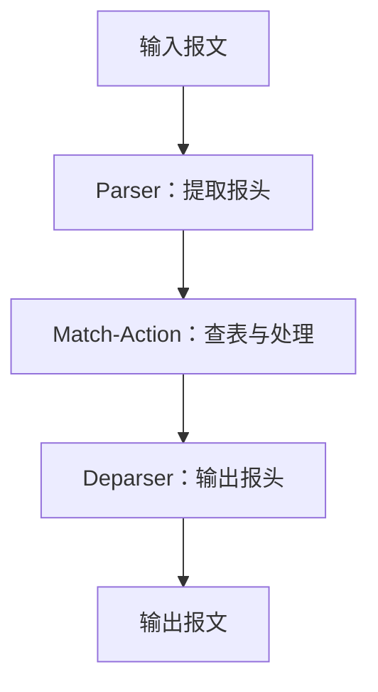
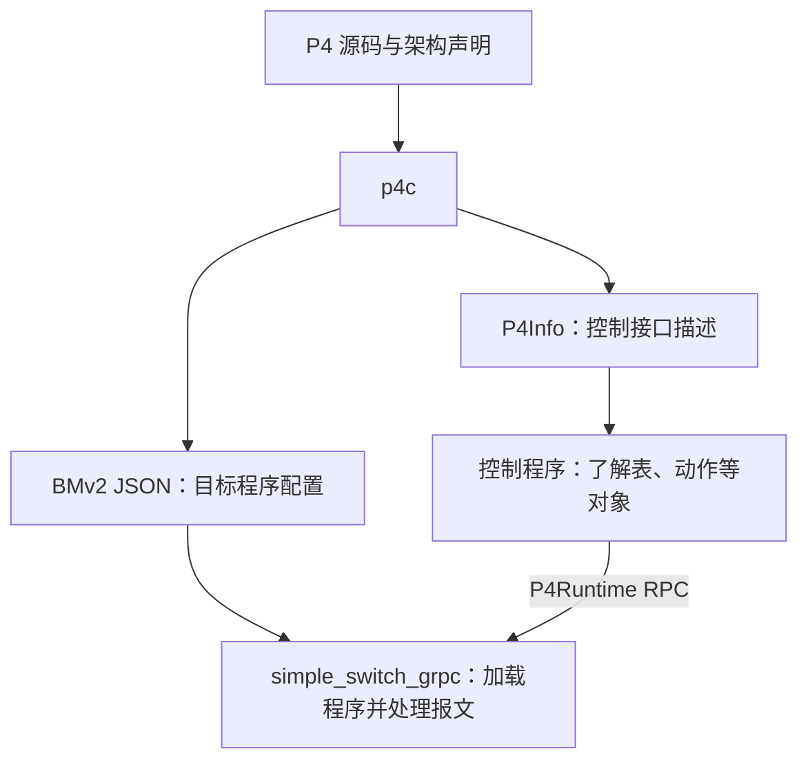

# 02 · P4 概述与核心概念

本章介绍 P4 描述什么、程序怎样在目标上运行，以及数据平面与控制平面如何分工。语言概念以 P4<sub>16</sub> 规范 v1.2.5 为依据。涉及工作草案或具体编译器行为时另行说明。

## 2.1 P4 是什么

P4 的全称是 **Programming Protocol-independent Packet Processors**。它是一门面向报文处理的领域特定语言，用来描述网络设备的数据平面行为，例如提取报头字段、查表、修改报头，以及选择转发或丢弃。执行 P4 程序的目标可以是硬件，也可以是软件。

以 IPv4 转发为例，P4 程序可以规定：解析目的地址，用它查询路由表，命中后修改目的 MAC 地址、递减 TTL，并设置出端口。至于路由如何计算、何时更新，由控制平面负责。

本教程用 BMv2 软件交换机学习这些行为。BMv2 上的功能验证不能直接说明程序在交换芯片上的资源占用、吞吐量或时延。

## 2.2 为什么需要数据平面编程

固定功能交换机通常已经确定了可解析的协议、匹配字段和动作集合。控制平面可以配置这些功能，例如增加一条路由，却未必能让设备识别一种全新的报头。

OpenFlow 提供了控制交换机的标准接口，但各版本规定的匹配字段与动作仍有范围。增加表项与扩展设备的报文处理能力，是两件不同的事。

P4 将报头格式、解析过程和匹配动作逻辑纳入程序描述，使程序员能够在目标支持的范围内定义数据平面。2014 年的 [P4 论文](https://doi.org/10.1145/2656877.2656890)讨论了这一动机，以及 P4 与 OpenFlow 等控制协议的关系。P4 是语言，OpenFlow 是控制协议，不能简单按功能“包含”关系比较。

## 2.3 三个设计目标及其边界

P4 最初提出了协议无关、目标无关和部署后可重配置三个目标。理解它们时，需要同时考虑目标的实际能力。

### 协议无关

程序通过报头类型和解析逻辑描述要处理的字段，语言不内置一套固定的网络协议集合。例如，以太网地址和 IPv4 地址的名称、位宽及提取顺序都可以在源码中定义。

可解析的深度、可处理的字段宽度及可用运算仍受目标约束。定义出一个报头类型，不等于任意设备都能按期望的速率处理它。

### 目标无关

P4 提供独立于具体设备指令集的表达方式，由编译器完成映射。程序仍然依赖所选架构的接口，例如元数据、可编程块的参数和外部功能。

因此，迁移程序时需要检查架构是否一致、所用功能是否受支持，以及资源是否足够。针对 V1Model 编写的程序，通常不能仅替换一个编译选项，就直接用于另一架构。即便两个目标实现相同架构，也可能有不同的容量与操作限制。

### 部署后可重配置

支持重配置的目标可以加载新的数据平面程序。这里应区分两类修改：

| 修改                           | 通常涉及的操作                     |
| ------------------------------ | ---------------------------------- |
| 为已有 IPv4 路由表增加下一跳   | 控制平面更新表项，无须改变程序结构 |
| 增加此前未定义的报头及处理逻辑 | 修改 P4 源码，重新编译并部署       |

重新部署是否中断转发、能否保留表项和有状态对象，取决于目标与部署方式。语言不保证毫秒级切换或无损更新；即使使用 P4Runtime 的 `RECONCILE_AND_COMMIT`，其[规范](https://p4lang.github.io/p4runtime/spec/v1.4.1/P4Runtime-Spec.html)也未限定流量损失持续时间，且目标可以不支持该操作。

## 2.4 PISA、架构与目标

**PISA**（Protocol-Independent Switch Architecture，协议无关交换架构）是一种理解可编程交换机的常见模型。其主要可编程部分可概括为下面的逻辑流程：



图中省略了负载传递、缓存、队列和调度等细节，也不表示每个报文都一定从端口发出。架构接口及其配套语义见 [10.2 节](./10-架构与包.md#102-架构描述包含什么)。

P4<sub>16</sub> 可以面向不同类型的报文处理系统，并未要求所有目标都采用 PISA。阅读程序时，应区分以下几个层次：

| 层次         | 回答的问题                             | 本教程中的例子       |
| ------------ | -------------------------------------- | -------------------- |
| 语言         | 可以声明哪些类型，语句如何执行         | P4<sub>16</sub>      |
| 架构         | 有哪些可编程块，它们如何与目标交换数据 | V1Model              |
| 目标实现     | 谁执行程序，支持哪些操作与资源         | BMv2 `simple_switch` |
| 编译器及后端 | 怎样把程序映射到目标                   | p4c 的 BMv2 后端     |

PISA 用来说明一类交换机的组织方式；V1Model、PSA 等 P4 架构则规定具体接口与行为。它们不应作为同义词使用。架构与目标的关系将在 [第 10 章](./10-架构与包.md)进一步展开。

## 2.5 一份程序由什么组成

下面按 V1Model 示例说明各部分的职责。实际程序不一定需要表，也不一定需要解析报头；第 3 章的 Hello P4 就只做报文反射。

| 组成部分   | 用途                                                                 |
| ---------- | -------------------------------------------------------------------- |
| 类型声明   | 描述报头字段，以及程序中使用的元数据                                 |
| `parser`   | 用状态机描述字段提取和解析分支                                       |
| `control`  | 描述数据平面的处理顺序、条件分支和调用                               |
| `action`   | 封装报头、元数据等数据的处理操作                                     |
| `table`    | 根据键查询表项，选择动作及其参数                                     |
| Deparser   | 在本教程的架构中，由调用 `packet_out.emit` 的 `control` 实现报头输出 |
| 顶层包实例 | 将可编程块装配到架构接口上，如 `V1Switch(...) main`                  |

例如，下面的控制块取自 [Hello P4](../examples/01-hello/hello.p4)，其作用是把出端口设为入端口：

```p4
control MyIngress(inout headers hdr,
                  inout metadata meta,
                  inout standard_metadata_t std_meta) {
    apply {
        std_meta.egress_spec = std_meta.ingress_port;
    }
}
```

这是完整程序中的一个片段，依赖源码中的类型声明与架构定义，不能单独编译。`standard_metadata_t` 和其中的端口字段来自 V1Model；`control`、`apply` 与赋值语句属于 P4 语言。

这里的 `control` 是**数据平面控制块**。它处理当前报文，与计算路由、下发表项的“控制平面程序”不是同一概念。

## 2.6 P4<sub>14</sub> 与 P4<sub>16</sub>

本教程使用 P4<sub>16</sub>。阅读旧资料时，先确认其语言版本：

| 语言版本        | 与本教程关系较大的区别                                       |
| --------------- | ------------------------------------------------------------ |
| P4<sub>14</sub> | 语言包含较多交换机模型的约定，以及计数器、寄存器等专用构造   |
| P4<sub>16</sub> | 将具体架构从语言中分离，以类型、包和 `extern` 等机制表达接口 |

P4<sub>16</sub> 的第一版正式规范于 2017 年发布。“P4<sub>16</sub>”是语言版本名称，`1.2.5` 是该语言规范的修订号，它们又不同于 `p4c --version` 输出的编译器版本。工作草案还可能包含正式版本尚未收录的内容。

p4c 提供从 P4<sub>14</sub> 转换到 P4<sub>16</sub> 的工具用法，见 [p4c 的转换用法](https://github.com/p4lang/p4c/blob/8b6de3c579e717ee278c38041b868e9ef2345f5f/README.md#sample-backends-in-p4c)。转换结果仍需检查架构依赖与实际行为，不宜直接视为已经完成迁移。

## 2.7 数据平面与控制平面怎样配合

在本教程的 P4Runtime 实验中，源码、编译产物与控制程序的关系如下：



图中表示各部分的用途，省略了连接建立、主控仲裁与配置校验。使用 P4Runtime 部署时，控制程序将 P4Info 与目标程序配置一起提交给服务端。

**P4Info** 描述控制平面可访问的表、动作及其他实体，例如名称、标识符、匹配字段和参数。它不代替 BMv2 JSON，也不是当前表项内容的快照。

**P4Runtime** 是基于 gRPC 的标准控制接口，除表项读写外，还涉及计数器等实体、报文收发和流水线配置；具体功能需由服务端实现。接口与 P4Info 的定义见 P4Runtime 规范 v1.4.1。

P4 程序也可以使用其他控制接口。本仓库编号示例 02~05 默认使用 `simple_switch_CLI`，通过 Thrift 配置 `simple_switch`。示例 01 无需表项配置，示例 05 另提供 P4Runtime 方式。因此，使用 P4 语言并不要求同时使用 P4Runtime，两种 BMv2 进程的用途见 [14.1 节](./14-BMv2编译与运行.md#141-工具链与编译产物)。

设备管理还有其他接口：gNMI 用于配置、状态查询与遥测，gNOI 用于重启等运维操作；gRPC 是这些接口可以采用的远程调用框架，不能与它们列为同一层次的协议。相关职责见 [OpenConfig RPC 说明](https://openconfig.net/rpc/)。

## 2.8 从路由表示例理解分工

假设数据平面已经定义了一张以 IPv4 目的地址做最长前缀匹配的表，并提供“设置下一跳与出端口”的动作：

1. P4 程序规定匹配字段、匹配方式和可选动作。
2. 控制平面根据路由计算或静态配置，写入“`10.0.2.0/24` 对应下一跳与端口”的表项。
3. 报文到达后，数据平面解析地址、查表并执行动作，无须每个报文都先交给控制平面决策。

如果只改变这个网段的下一跳，通常更新表项即可；如果希望新增按另一个报头字段匹配的功能，则需要检查现有程序是否已经定义了相应的解析逻辑与表。

有些表项也可以直接写在 P4 源码中，例如 `const entries`。所以“表的结构由程序定义”不意味着“所有表项都必须在运行时下发”。表项的初始化与可修改性见 [第 8 章](./08-匹配动作表.md)。

## 2.9 编程时需要注意的限制

### 循环与递归

P4<sub>16</sub> v1.2.5 允许同一解析器的状态转换形成环，例如重复提取报头栈中的元素；目标仍可限制解析深度，或拒绝无法满足其要求的循环。语言禁止直接或相互递归的调用，解析器状态环不属于这种递归。

v1.2.5 没有定义通用 `for` 语句。本机 p4c `1.2.5.10` 的检查结果说明了语法支持与后端支持的区别：一个迭代两次的 `for` 示例通过 `p4test`，但 `p4c-bm2-ss` 在默认选项下报 `BMV2 does not support loops`；使用两元素报头栈的解析器环则编译通过。本教程的 BMv2 入门示例不依赖 `for` 语句。

### 类型与状态

报头处理经常使用显式位宽的整数，但 P4 也有布尔、枚举、结构体等类型，不能把类型系统概括为“一切都是位串”。

报文间需要保留的数据通常通过架构提供的 `extern` 对象访问，例如 V1Model 的寄存器、计数器和计量器。元数据用于传递当前报文处理过程中的信息，不应被当作报文间自动共享的变量。对象的接口与并发语义将在第 12 章说明。

### 处理路径与资源

报文可以被丢弃、复制，或经架构提供的重新提交、重循环机制再次处理，并不总是只经过一次流水线。这些路径属于架构与目标的行为，不能等同于在 P4 中编写递归函数。

判断一个程序是否可用，需要依次检查语言语义、架构接口、后端支持和目标资源，再验证实际报文行为。编译通过是其中一步。

## 2.10 本章小结

- P4 描述数据平面的报文处理行为；控制平面负责计算策略并配置相应对象。
- 架构定义接口，目标实现提供能力，编译器完成映射。跨目标迁移需要核对这三者。
- PISA 是常见的可编程交换机模型，不是 P4<sub>16</sub> 对所有目标的统一要求。
- 修改表项与替换程序是不同操作；P4Runtime 是可选的标准控制接口。
- 使用某项语言特性前，应确认规范版本和目标编译器的支持情况。

## 2.11 下一步

进入 [03 · 第一个 P4 程序](./03-第一个P4程序.md)，结合 Hello P4 观察程序结构和报文路径。语法细节从 [第 4 章](./04-语法基础.md)开始介绍。
