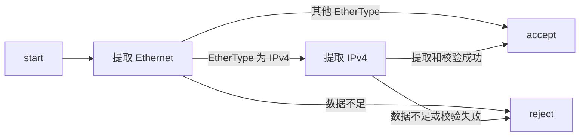

# 06 · Parser 解析器

本章讨论 Parser 如何读取报文、选择解析路径和报告错误。语言规则以 P4<sub>16</sub> 规范 v1.2.5 为依据；涉及 V1Model 与 BMv2 时，另行说明目标行为。本机验证使用 p4c 1.2.5.10 和 `simple_switch` 1.15.0

前半章的代码是片段，需要补齐类型、状态和架构接口。6.14 节给出可独立编译的完整 V1Model 程序。

## 6.1 Parser 是什么

Parser 用状态机描述怎样从输入报文中提取数据。它从 `start` 状态开始，按状态内的语句顺序执行，再转移到其他状态，直到到达 `accept` 或 `reject`。



这个图只展示一种解析策略。`accept` 表示解析成功结束，不表示整份报文已被读完，也不表示所有协议约束都已校验。`reject` 表示解析失败，后续是否丢包由架构和程序决定。

在 BMv2 的 V1Model 流水线中，解析错误通过 `standard_metadata_t.parser_error` 传给后续处理块，报文仍会进入 Ingress。若希望丢弃解析失败的报文，程序必须检查这个字段并执行丢包操作，见 6.7 节和 [BMv2 的 Parser 说明](https://github.com/p4lang/behavioral-model/blob/main/docs/simple_switch.md#restrictions-on-parser-code)。

## 6.2 Parser 的结构

一个 Parser 实现由参数、可选的构造参数、局部声明和状态组成：

```text
parser 名称(调用参数)(可选的构造参数) {
    局部常量、变量、extern／子解析器实例、value_set
    state start { ... }
    state parse_ipv4 { ... }
    ...
}
```

必须定义且只能定义一个 `start`。`accept`、`reject` 是隐含的终态，不能重新声明。状态名与 Parser 局部声明共享命名空间，不能重名。

状态内部可以声明局部变量、赋值、调用允许的方法或函数，也可以使用 `if` 和块语句。状态循环与递归调用是两回事，见 6.10 节。

## 6.3 声明语法

以下接口对应本教程的 V1Model。`headers`、`metadata` 由用户定义，`standard_metadata_t` 来自 `v1model.p4`：

```p4
parser MyParser(packet_in packet,
                out headers hdr,
                inout metadata meta,
                inout standard_metadata_t sm) {
    state start {
        packet.extract(hdr.ethernet);
        transition select(hdr.ethernet.etherType) {
            0x0800: parse_ipv4;
            default: accept;
        }
    }
    state parse_ipv4 {
        packet.extract(hdr.ipv4);
        transition accept;
    }
}
```

`packet_in` 由架构提供，不能由用户自行实例化。`hdr` 是 `out` 参数，调用开始时其中的报头有效位被初始化为无效；普通元数据字段并不因此自动清零。参数方向规则见 [4.8 节](./04-语法基础.md#48-参数方向修饰符)。

规范 v1.2.5 区分 Parser 类型声明和带状态体的 Parser 实现：类型声明可以带类型参数，实现声明不允许泛型。例如，架构中的 `parser Parser<H, M>(...);` 是类型接口，不是带状态体的实现。本机 p4c 也能接受某些泛型 Parser 实现，但本章使用符合上述版本规则的具体实现。

## 6.4 `transition` 语句

状态最后可以写一条 `transition`，目的地为状态名，或由 `select` 选择的状态：

```p4
state finish {
    transition accept;
}
state parse_next {
    transition parse_ipv4;
}
```

按语言规则，省略状态末尾的转移等价于 `transition reject;`。不过，**本机 p4c 的 BMv2 后端不支持显式转移到 `reject`**：它会给出警告，却仍生成 JSON，不能把编译成功当作拒绝路径正确。对需要报告错误的分支，应进入调用 `verify(false, 自定义错误)` 的状态。

例如，先在顶层声明错误，再定义失败状态：

```p4
error { UnsupportedEtherType }
```

```p4
state unsupported_type {
    verify(false, error.UnsupportedEtherType);
    transition accept; // verify 必定失败，运行时不会执行到这里
}
```

这也避免了靠省略 `transition` 隐式进入不受支持路径的问题。

### 6.4.1 `select` 表达式

```p4
transition select(hdr.ethernet.etherType) {
    0x0800: parse_ipv4;
    0x86DD: parse_ipv6;
    0x0806: parse_arp;
    default: unsupported_type;
}
```

冒号左边是匹配集合，右边是目的状态。标签按源码顺序检查，**第一个匹配的标签决定转移**；掩码与范围可以重叠，不能按最长前缀或“更精确的条件优先”理解。

按语言规范，如果没有标签匹配，也没有 `default` 或 `_` 兜底，Parser 应以 `error.NoMatch` 失败。通配标签之后的分支不可达，所以通常将它放在最后。

本机 p4c／BMv2 组合存在一处实现差异：未匹配且没有兜底分支时，解析会结束，但 `parser_error` 仍为 `NoError`。实验程序应显式写出兜底策略；需要报错时，让 `default` 转到执行 `verify(false, error.NoMatch)` 的状态。该现象已用报文验证，也与此版本 [BMv2 的状态选择实现](https://github.com/p4lang/behavioral-model/blob/2bdd0b7b2b2ae89faf2720f2158e9842bc6d2dd2/src/bm_sim/parser.cpp#L1050-L1085) 一致。

`select` 可以根据固定位宽整数、`bool`、枚举及相应元组选择状态，也可结合 `lookahead`。本章使用编译期常量标签；需要控制平面更新匹配集合时，可使用目标支持的 Parser `value_set`，见 [第 13 章](./13-注解与高级特性.md)。

### 6.4.2 多字段联合选择

多个字段按元组共同匹配：

```p4
transition select(hdr.ipv4.ihl, hdr.ipv4.protocol) {
    (4w5, 8w6): parse_tcp;
    (4w5, 8w17): parse_udp;
    (_, _): accept;
}
```

每一项分别与对应字段匹配，位宽也分别检查。这里只展示分发语法；实际解析 TCP／UDP 前还应处理 IPv4 选项和分片。尤其是非首片，不能仅凭 `protocol` 字段就把当前负载当作传输层报头。

## 6.5 标签集合的语法

### 6.5.1 单元素

`8w6: parse_tcp;` 匹配单个值。标签类型须与被选择的字段相容；无宽度字面量可以按上下文转换，已经具有不同位宽的值不会任意自动转换。

### 6.5.2 全集

单独的 `default` 或 `_` 匹配所有尚未匹配的值。多字段标签中的 `_` 则只表示对应项不关心，例如 `(4w5, _)` 要求第一项为 5，而不限制第二项。

兜底分支进入 `accept`、其他解析状态，还是报告错误，是程序的策略选择，不由 `default` 这个词决定。

### 6.5.3 掩码 `&&&`

`value &&& mask` 描述满足 `(输入 & mask) == (value & mask)` 的值。掩码位为 0 的位置不参与比较。

例如，`8w0x0A &&& 8w0x0F` 匹配低四位为 `1010` 的 16 个值。对 16 位端口字段，下列分支匹配 0–1023：

```p4
transition select(hdr.tcp.dstPort) {
    16w0 &&& 16w0xFC00: well_known_port;
    default: other_port;
}
```

### 6.5.4 区间 `..`

区间包含两个端点。`8w5 .. 8w8` 表示 5、6、7、8；结束值小于开始值时表示空集。

不要把它写成 `4s5 .. 4s8`：`int<4>` 只能表示 −8 到 7，`4s8` 的位模式会被解释成 −8，无法表达这里需要的上界 8。

## 6.6 `extract` 方法

`packet_in` 的主要方法如下。它们已经由 `core.p4` 声明，程序不需要重复声明：

| 方法                 | 作用及单位                                             |
| -------------------- | ------------------------------------------------------ |
| `extract(hdr)`       | 提取一个定长报头，成功后推进游标                       |
| `extract(hdr, bits)` | 提取含一个 `varbit` 字段的报头；第二参数是该字段的位数 |
| `lookahead<T>()`     | 查看当前位置的定长数据，不推进游标                     |
| `advance(bits)`      | 按位数推进游标，不保存数据                             |
| `length()`           | 返回输入报文总长度，单位为字节；不是剩余长度           |

`length()` 并非所有架构都支持。程序开始处理报文时，某些目标可能尚未收到完整报文，无法提供这个值。

### 6.6.1 固定宽度 `extract(hdr)`

单参数 `extract` 的目的对象必须是定长 **header**，不是普通的 `bit<W>` 或任意结构体。

```p4
state parse_ethernet {
    packet.extract(hdr.ethernet);
    transition accept;
}
```

成功时会按字段声明顺序提取数据，使报头有效，并把输入游标推进报头长度所对应的**位数**。例如，14 字节的以太网报头消耗 112 位。整数字段最先读入的位成为该字段的最高有效位，报头有效位不从报文中读取。

剩余数据不足时，操作以 `error.PacketTooShort` 失败，后续状态语句不再执行。不要依赖失败后的目标报头字段；应先按 `parser_error` 分流处理。

### 6.6.2 可变宽度 `extract(hdr, bits)`

目的报头必须包含恰好一个 `varbit` 字段，长度参数类型为 `bit<32>`，表示**可变长字段本身**的位数，不包含报头的固定部分。

```p4
header Variable_h {
    bit<16> kind;
    varbit<64> data;
}
```

若 `hdr.variable` 为这个类型，`packet.extract(hdr.variable, 32w24)` 总共读取 `16 + 24 = 40` 位，而不是 24 位。

超出声明容量会产生 `error.HeaderTooShort`；报文剩余数据不足会产生 `error.PacketTooShort`。目标还可能拒绝不满足对齐等要求的长度，并报告 `error.ParserInvalidArgument`。这些错误不是同一个概念；多个条件同时违规时，不应依赖所有实现都按同一顺序报告。

IPv4 可以把固定的 20 字节部分与选项分成两个报头。以下片段假设 `hdr.ipv4` 是固定部分，`hdr.options` 包含一个 `varbit<320>` 字段，自定义错误已声明：

```p4
state parse_ipv4 {
    packet.extract(hdr.ipv4);
    verify(hdr.ipv4.version == 4, error.IPv4BadVersion);
    verify(hdr.ipv4.ihl >= 5, error.IPv4InvalidIhl);
    transition select(hdr.ipv4.ihl) {
        5: accept;
        default: parse_options;
    }
}
state parse_options {
    packet.extract(hdr.options, ((bit<32>)hdr.ipv4.ihl - 5) << 5);
    transition accept;
}
```

IHL 以 32 位字为单位，合法最小值为 5。选项长度为 `(IHL - 5) × 32` 位，最大为 320 位；先校验下界，再扩宽计算，避免无符号下溢或窄位宽运算截断。IHL、Total Length 和分片字段的定义见 [RFC 791 第 3.1 节](https://www.rfc-editor.org/rfc/rfc791.html#section-3.1)。

## 6.7 `verify` 与解析错误

`verify(条件, 错误)` 是核心库提供的特殊 extern 函数调用，只能用于 Parser。条件为真时继续执行；为假时立即记录错误并结束当前解析路径，不再执行状态内剩余语句。

错误名需要已有声明：

```p4
error { IPv4BadVersion, IPv4InvalidIhl }
```

```p4
verify(hdr.ipv4.version == 4, error.IPv4BadVersion);
verify(hdr.ipv4.ihl >= 5, error.IPv4InvalidIhl);
```

语言定义解析错误的产生，架构定义如何把错误交给后续处理。在 V1Model 中，应在 Ingress 使用实际参数名访问 `parser_error`。例如，假设参数名为 `sm`：

```p4
if (sm.parser_error != error.NoError) {
    mark_to_drop(sm);
    exit;
}
```

`mark_to_drop` 来自 V1Model，`exit` 结束当前控制处理，防止后面的赋值覆盖丢包决定。不能在 Parser 中用 `exit` 代替失败转移，也不能只检查 `hdr.ipv4.isValid()`：报头可能已提取成功，随后才因 `verify` 失败而结束解析。

| 错误                    | 常见原因                                                        |
| ----------------------- | --------------------------------------------------------------- |
| `PacketTooShort`        | `extract`、`lookahead` 或 `advance` 所需数据超出输入报文        |
| `NoMatch`               | 规范规定的 `select` 未匹配错误；本机目标需显式兜底，见 6.4.1 节 |
| `StackOutOfBounds`      | Parser 访问越界的报头栈 `next`／`last`                          |
| `HeaderTooShort`        | 可变长提取超过报头声明容量                                      |
| `ParserInvalidArgument` | 解析操作参数不满足目标要求                                      |
| 用户声明的错误          | `verify` 条件失败                                               |

校验和错误另有架构接口。例如 V1Model 的 `verify_checksum` 使用 `checksum_error`，不能把它与 Parser 中的 `verify` 混为一谈。

## 6.8 `lookahead`

`packet.lookahead<T>()` 从当前游标查看一个定长值，但不消耗输入。T 须有确定的固定宽度，且受目标支持范围限制；数据不足时同样产生 `PacketTooShort`。

假设 `Byte_h` 含一个 `bit<8>` 字段 `value`，下面的两次读取从同一位置开始：

```p4
bit<8> peeked = packet.lookahead<bit<8>>();
packet.extract(hdr.byte);
```

如果两步都成功，`peeked` 与 `hdr.byte.value` 相同，只有后一步把游标推进 8 位。若 `lookahead` 返回的类型包含报头，成功返回的报头是有效的。

解析 TCP 选项时，可以先查看 kind，再转移到对应状态：

```p4
transition select(packet.lookahead<bit<8>>()) {
    0: option_end;
    1: option_nop;
    2: option_mss;
    default: option_other;
}
```

这只是分发片段。完整实现还要依据 TCP 数据偏移限制选项区域，检查选项长度，并让继续循环的路径消耗输入；仅仅反复 `lookahead` 不会向前推进。

## 6.9 `advance` 与跳过

`packet.advance(32)` 消耗 32 位，不保存其内容。数据不足时以 `PacketTooShort` 失败，目标也可能对动态长度及对齐方式施加限制。

另一种形式是向 `_` 提取，类型参数仍然必须是报头：

```p4
header Skip32_h {
    bit<32> data;
}
```

在 Parser 状态中：

```p4
packet.extract<Skip32_h>(_);
```

`packet.extract<bit<32>>(_)` 不符合固定报头提取的要求，本机 BMv2 后端会拒绝它。只想跳过固定位数时，直接使用 `advance` 更清楚。

跳过的数据既未保存为报头，又已离开未解析负载区。在 BMv2 中，它不会自动出现在 Deparser 输出中；若希望保留内容，应提取到有名字的报头并按需 `emit`。

## 6.10 报头栈解析

`hs.next` 引用下一解析位置，成功向它提取后索引递增；`hs.last` 只读地访问刚才的位置。下面只解析最多三个 MPLS 标签，并在栈底结束解析：

```p4
header Mpls_h {
    bit<20> label;
    bit<3> tc;
    bit<1> bos;
    bit<8> ttl;
}
struct MplsHeaders {
    Mpls_h[3] labels;
}
parser ParseMpls(packet_in packet, out MplsHeaders hdr) {
    state start {
        transition parse_label;
    }
    state parse_label {
        packet.extract(hdr.labels.next);
        transition select(hdr.labels.last.bos) {
            0: parse_label;
            1: accept;
        }
    }
}
```

调用这个子解析器前，游标应已位于第一个 MPLS 标签。第三个标签的 BOS 为 0 时，状态会再次尝试访问 `next`，此时已超出容量，产生 `StackOutOfBounds`。

BOS 为 1 只说明标签栈到此结束，不能直接推出后面一定是 IPv4。后续协议须根据标签语义和部署约定等确定，见 [RFC 3032 第 2.2 节](https://www.rfc-editor.org/rfc/rfc3032.html#section-2.2)。

这里的状态回边是合法的 Parser 循环，不是递归调用。目标可以限制状态访问次数、要求循环能展开，或拒绝无法证明推进的循环；不能把某个硬件的限制写成“P4 不允许 Parser 循环”。达到目标解析时间限制时，架构可按规则报告 `ParserTimeout`。

## 6.11 子解析器（Sub-parser）

Parser 可以实例化另一个 Parser，并在状态中调用其 `apply`。下面假设 `IPv4_h` 为已定义的固定 IPv4 报头，错误名也已声明：

```p4
parser ParseIPv4(packet_in packet, out IPv4_h ipv4) {
    state start {
        packet.extract(ipv4);
        verify(ipv4.version == 4, error.IPv4BadVersion);
        transition accept;
    }
}
parser Outer(packet_in packet, out IPv4_h ipv4) {
    ParseIPv4() inner;
    state start {
        inner.apply(packet, ipv4);
        transition accept;
    }
}
```

这个例子的入口已经位于 IPv4 报头，没有再次提取 Ethernet。两个 Parser 使用同一个 `packet_in`，子解析器消耗的数据会反映在返回后的游标位置。

子解析器到达 `accept`，调用者从 `apply` 后继续执行；子解析器发生解析失败，则失败传播到调用者，后面的语句不再执行。直接或间接递归调用均不允许。

`out` 报头参数仍遵守有效性初始化规则。如果需要子解析器继续修改已经提取的报头，应根据用途选择 `inout`，而不是误用 `out` 后依赖原有内容。

## 6.12 Parser 里的局部变量与实例

状态前可以声明常量、局部变量、Parser `value_set`，以及架构允许的 extern 或子解析器实例。不能在 Parser 内实例化 Control。

```p4
parser CountBytes(packet_in packet, out bit<8> count) {
    bit<8> parsed = 0;
    state start {
        packet.advance(8);
        parsed = parsed + 1;
        count = parsed;
        transition accept;
    }
}
```

局部变量在 Parser 的一次调用中保存值，不是跨报文的计数器；上例每次成功调用都输出 1。状态内声明的名字只在相应块内可见。实例化的 extern 是否有跨调用状态、能在哪些块中使用，由它的接口和架构规定。

`core.p4` 不定义 `Checksum16`。[VSS 参考示例](../examples/vss/README.md#解析与校验和)中的同名对象提供 `clear`、`update`、`remove` 和无参数的 `get()`。本机 V1Model 头文件则保留了已弃用的 `Checksum16.get(data)`，两者接口不同。本章的 V1Model 程序应在相应校验和控制块中使用 `verify_checksum`、`update_checksum`，见 [12.8 节](./12-外部对象Extern.md#128-校验和接口)。

## 6.13 可用操作与限制

| 操作                   | 语言与目标规则                                          |
| ---------------------- | ------------------------------------------------------- |
| 状态转移形成循环       | 语言允许，需满足目标的循环和资源限制                    |
| 递归调用 Parser        | 不允许                                                  |
| 调用表、Control 或动作 | 不能在 Parser 中调用                                    |
| `return`、`exit`       | 不能在 Parser 中使用                                    |
| 赋值、整数运算、`if`   | 语言允许，具体运算和复杂度受目标限制                    |
| 普通 `switch`          | 本章采用的规范不允许用于 Parser，应使用状态转移选择分支 |
| 调用 extern 或函数     | 须符合语言调用规则，以及目标对该接口的限制              |

“能做算术”与“目标能实现任意计算”并不等价；“状态图有回边”也不等于递归。

## 6.14 完整示例：Ethernet、单层 VLAN 与 IPv4 选项

下面是完整的 V1Model 程序，可以保存为 `parser-demo.p4`。它识别普通 Ethernet、至多一层 TPID 为 `0x8100` 的 VLAN，以及 IPv4 固定报头和选项；未知 EtherType 按本例策略结束解析。Ingress 丢弃有解析错误的报文，其余报文从原入端口原样发回，方便检查提取与重组是否一致。

```p4
#include <core.p4>
#include <v1model.p4>

error { IPv4BadVersion, IPv4InvalidIhl, IPv4InvalidTotalLength }

header ethernet_t {
    bit<48> dst;
    bit<48> src;
    bit<16> etherType;
}
header vlan_t {
    bit<3> pcp;
    bit<1> dei;
    bit<12> vid;
    bit<16> etherType;
}
header ipv4_t {
    bit<4> version;
    bit<4> ihl;
    bit<8> diffserv;
    bit<16> totalLen;
    bit<16> identification;
    bit<3> flags;
    bit<13> fragOffset;
    bit<8> ttl;
    bit<8> protocol;
    bit<16> hdrChecksum;
    bit<32> src;
    bit<32> dst;
}
header ipv4_options_t {
    varbit<320> data;
}
struct headers {
    ethernet_t ethernet;
    vlan_t vlan;
    ipv4_t ipv4;
    ipv4_options_t options;
}
struct metadata { }

parser MyParser(packet_in packet,
                out headers hdr,
                inout metadata meta,
                inout standard_metadata_t sm) {
    state start {
        packet.extract(hdr.ethernet);
        transition select(hdr.ethernet.etherType) {
            0x8100: parse_vlan;
            0x0800: parse_ipv4;
            default: accept;
        }
    }
    state parse_vlan {
        packet.extract(hdr.vlan);
        transition select(hdr.vlan.etherType) {
            0x0800: parse_ipv4;
            default: accept;
        }
    }
    state parse_ipv4 {
        packet.extract(hdr.ipv4);
        verify(hdr.ipv4.version == 4, error.IPv4BadVersion);
        verify(hdr.ipv4.ihl >= 5, error.IPv4InvalidIhl);
        verify(hdr.ipv4.totalLen >= ((bit<16>)hdr.ipv4.ihl << 2),
               error.IPv4InvalidTotalLength);
        transition select(hdr.ipv4.ihl) {
            5: accept;
            default: parse_options;
        }
    }
    state parse_options {
        packet.extract(hdr.options, ((bit<32>)hdr.ipv4.ihl - 5) << 5);
        transition accept;
    }
}

control MyVerifyChecksum(inout headers hdr, inout metadata meta) {
    apply { }
}
control MyIngress(inout headers hdr, inout metadata meta,
                  inout standard_metadata_t sm) {
    apply {
        if (sm.parser_error != error.NoError) {
            mark_to_drop(sm);
            exit;
        }
        sm.egress_spec = sm.ingress_port;
    }
}
control MyEgress(inout headers hdr, inout metadata meta,
                 inout standard_metadata_t sm) {
    apply { }
}
control MyComputeChecksum(inout headers hdr, inout metadata meta) {
    apply { }
}
control MyDeparser(packet_out packet, in headers hdr) {
    apply {
        packet.emit(hdr.ethernet);
        packet.emit(hdr.vlan);
        packet.emit(hdr.ipv4);
        packet.emit(hdr.options);
    }
}

V1Switch(MyParser(), MyVerifyChecksum(), MyIngress(), MyEgress(),
         MyComputeChecksum(), MyDeparser()) main;
```

从保存文件的目录编译：

```bash
p4test --std p4-16 parser-demo.p4
p4c-bm2-ss --std p4-16 --arch v1model -o parser-demo.json parser-demo.p4
```

这个示例只检查 IPv4 版本、IHL 下界及 `totalLen` 不小于报头长度，并由 `extract` 检查所需报头数据是否足够。它不验证 IPv4 校验和，不解析 TCP／UDP，不检查全部 IP 负载是否与 `totalLen` 一致，也不按 `totalLen` 裁剪以太网填充。多层 VLAN 和其他 TPID 没有进一步解析，不能把它当作完整路由器或协议合法性检查器。

选项被提取后必须在 Deparser 中重新输出，否则这些已消耗的数据会丢失。反之，尚未解析的负载由 BMv2 保留，接在 `emit` 输出之后。以上也是本例校验正常报文逐字节不变的依据。

可用以下情况检查行为：

| 输入                                               | 预期                           |
| -------------------------------------------------- | ------------------------------ |
| 普通 IPv4、单层 VLAN + IPv4                        | 原端口返回，内容不变           |
| IHL 为 6 或 15，选项字节完整                       | 选项及负载均保留               |
| 未识别的 EtherType                                 | 按本例策略保留其负载并返回     |
| IPv4 版本错误、IHL 小于 5、`totalLen` 小于报头长度 | 记录自定义错误，Ingress 丢弃   |
| Ethernet、VLAN、IPv4 固定部分或所需选项被截断      | `PacketTooShort`，Ingress 丢弃 |

## 6.15 本章小结

Parser 操作同时影响输入游标、报头有效性和错误状态。阅读或修改程序时，应检查每条路径消耗多少位、何时结束，以及失败后哪些语句不会继续执行。状态结束后的报文去向还取决于架构与控制块，不能仅凭 `accept`／`reject` 的名字判断是否转发或丢弃。

## 6.16 下一步

[第 7 章](./07-控制块与动作.md)介绍控制块与动作，继续讨论解析之后怎样检查元数据、组织处理流程和选择报文去向。
