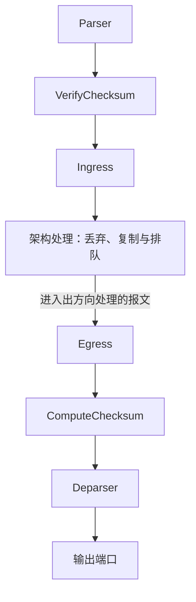

# 07 · 控制块与动作

本章介绍 Control 和 Action 的声明、调用及控制流。语言规则依据 P4<sub>16</sub> 规范 v1.2.5，架构示例使用 V1Model。本机验证环境为 p4c 1.2.5.10、`simple_switch` 1.15.0。

前半章的片段需要放入相应声明或调用位置；其中的 `headers`、`metadata` 可采用 7.12 节的定义。7.12 节给出可独立编译的完整程序。[第 8 章](./08-匹配动作表.md)继续介绍表的匹配规则和控制平面配置。

## 7.1 控制块是什么

Parser 提取报头后，控制块可以读取和修改报头、元数据，调用表选择动作，也可以调用其他控制块。控制块中的语句按源码顺序执行；目标负责将这些操作映射到实际流水线，并检查资源和操作限制。

Ingress、Egress 是 V1Model 赋予控制块的架构角色。`control` 本身并不等于 Ingress：校验和处理和 Deparser 也通过控制块接口提供，但允许的操作有所不同。

## 7.2 Control 的约束

按语言规范，控制块不能实例化或调用 Parser，也不能递归调用自身或形成相互递归。它没有 Parser 的状态转移和 `reject` 机制，核心库的 `verify` 也不能用于控制块。解析错误进入控制流水线后的处理，需要程序检查架构提供的错误字段，见 [6.7 节](./06-Parser解析器.md#67-verify-与解析错误)。

`return` 结束当前控制块；`exit` 可以结束当前调用链上的控制块和动作。二者都不会自行设置丢包标记，具体区别见 7.10 节。

某个 extern 是否能在控制块内调用，还取决于架构对它的规定。例如，V1Model 的 `verify_checksum` 用于 `VerifyChecksum`，不能因为名称中有 `verify` 就把它当作 Parser 的校验函数。

## 7.3 Control 声明

以下控制块把成功解析的 Ethernet 报文送往端口 2：

```p4
control MyIngress(inout headers hdr,
                  inout metadata meta,
                  inout standard_metadata_t sm) {
    const bit<9> OUTPUT_PORT = 2;

    action drop() {
        mark_to_drop(sm);
    }

    apply {
        if (sm.parser_error != error.NoError) {
            drop();
            exit;
        }
        if (hdr.ethernet.isValid()) {
            sm.egress_spec = OUTPUT_PORT;
        } else {
            drop();
        }
    }
}
```

每个控制块实现必须有且只有一个 `apply { ... }`，作为运行时入口。前面的参数列表是调用参数；可选的第二组参数是构造参数，见 7.8.2 节。`sm` 是本例选择的参数名，不是语言关键字。

与 Parser 类似，规范 v1.2.5 区分控制块类型声明和带 `apply` 的实现声明：类型接口可以有类型参数，该版本对实现声明的规则则不允许泛型。本章使用具体类型的实现，避免混淆两者。

## 7.4 控制块里能放什么

`apply` 之前可以声明以下元素：

| 元素         | 用途或示例                                           |
| ------------ | ---------------------------------------------------- |
| 常量         | `const bit<9> OUTPUT_PORT = 2;`                      |
| 局部变量     | 保存本次调用的中间结果                               |
| extern 实例  | V1Model 的 `counter(1024, CounterType.packets) ctr;` |
| 动作         | `action drop() { mark_to_drop(sm); }`                |
| 表           | 定义匹配键、可执行动作等属性                         |
| 子控制块实例 | `InnerControl() inner;`                              |

局部动作和表可以访问所在控制块的参数及可见声明，因此不必把每个报头字段都写成动作参数。实例名及类型名区分大小写，例如 V1Model 中的计数器类型是 `counter`。

**普通局部变量不会跨调用保存值**，即使它声明在 `apply` 外部也是如此：

```p4
control CountVisits(out bit<8> count) {
    bit<8> local_count = 0;
    apply {
        local_count = local_count + 1;
        count = local_count;
    }
}
```

每次调用都输出 1；这个变量不能统计累计报文数。跨报文状态应通过架构支持的 `counter`、`register` 等 extern 保存。未初始化的普通局部变量也不能假定为零。

控制块的不同实例各自拥有局部表和 extern 实例。同一个控制块实例内的有状态对象可以在多次调用之间保存状态，前提是目标支持相应调用方式。

## 7.5 动作（Action）

### 7.5.1 什么是动作

动作是没有返回值的处理代码，可以读写可见的报头和元数据，调用允许的 extern、函数或其他动作。它不能调用表、Control 或 Parser，也不能递归调用。

动作可以在控制块内声明，也可以在顶层声明。局部动作只能在相应控制块的实例中使用。目标还可能限制动作内的分支、运算及资源访问；通过语言前端检查并不保证目标后端能够实现。

### 7.5.2 参数方向与动作数据

```p4
action Forward_a(out bit<9> outputPort, bit<9> port) {
    outputPort = port;
}
```

`outputPort` 是有方向参数，遵守复制入／复制出规则；`port` 没有方向，是动作数据。所有无方向参数必须位于有方向参数之后，动作参数不能是 extern 类型。

| 参数                 | 表调用时如何提供                                         | 直接调用时如何提供             |
| -------------------- | -------------------------------------------------------- | ------------------------------ |
| `in`／`out`／`inout` | 在表的 `actions` 列表中绑定表达式或存储位置              | 调用者提供实参                 |
| 无方向参数           | 由表项或默认动作提供，可来自控制平面，也可写在 P4 程序中 | 调用者提供实参，按只读输入使用 |

例如，下面将输出位置绑定到 `sm.egress_spec`，默认动作的数据为端口 2：

```p4
table port_fwd {
    key = { hdr.ethernet.dst: exact; }
    actions = { Forward_a(sm.egress_spec); }
    const default_action = Forward_a(sm.egress_spec, 9w2);
}
```

`actions` 中只绑定有方向参数，不能在这里把动作数据也填上。默认动作则必须补齐参数；其中的有方向实参须与 `actions` 中的绑定一致。表项命中时使用的是该表项的动作数据，不一定与默认动作相同。

### 7.5.3 调用方式

应用一张表会执行查找结果指定的动作；未命中时仍会执行默认动作。因此，“没有命中”不等于“没有执行动作”。

控制块的 `apply` 或另一个动作也可以直接调用动作，必须提供全部参数：

```p4
Forward_a(sm.egress_spec, 9w1);
```

直接调用时，无方向实参可以是运行时值。例如，下面把出端口设为当前入端口：

```p4
Forward_a(sm.egress_spec, sm.ingress_port);
```

这与 Parser／Control 的构造参数不同，不能一概把“无方向”解释为编译期常量。参数方向的通用规则见 [4.8 节](./04-语法基础.md#48-参数方向修饰符)。

## 7.6 `standard_metadata`（V1Model 快速入门）

`standard_metadata_t` 是 V1Model 提供的架构接口，不是 P4 语言内建类型。常用字段如下，读写阶段和单位见 [11.4 节](./11-V1Model架构.md#114-standard_metadata_t-速查)。

| 字段            | 主要使用位置 | 含义                                                                     |
| --------------- | ------------ | ------------------------------------------------------------------------ |
| `ingress_port`  | Ingress 读取 | 新到达报文的入端口编号，对应设备的端口配置                               |
| `egress_spec`   | Ingress 写入 | 普通单播的目标出端口，也用于表示丢包决定                                 |
| `egress_port`   | Egress 读取  | 架构选定的实际出端口；Ingress 中不应依赖其值                             |
| `packet_length` | 读取         | 报文长度，单位为字节；克隆等路径的规则见架构说明                         |
| `instance_type` | 读取         | 普通报文、克隆、重提交等处理路径的标识                                   |
| `parser_error`  | Ingress 读取 | 解析产生的错误，包括提取失败和 `verify` 失败；无错误时为 `error.NoError` |
| `deq_timedelta` | Egress 读取  | BMv2 中的排队时长，单位为**微秒**                                        |

端口号来自设备配置，不必对应物理插口。`egress_port` 应视为架构提供的只读信息；在 Egress 中重新赋值 `egress_spec` 也不能把已经排队到一个端口的普通单播报文改送其他端口。

在 `simple_switch` 中，丢包端口默认是 511，可以通过 `--drop-port` 修改。程序应使用 `mark_to_drop(sm)` 表达丢包决定，避免把 511 当作所有部署都固定使用的值。

## 7.7 `NoAction` 与 `mark_to_drop`

`core.p4` 提供一个空动作，其定义是：

```p4
action NoAction() { }
```

已经包含核心库时不应重复声明它。若一张表省略 `default_action`，编译器会将默认动作设为 `NoAction`，并把它加入动作列表；这不意味着每张已经显式指定默认动作的表都会自动包含它。

`NoAction` 不改写任何字段，也不表示转发或丢弃。比如此前已经设置出端口，执行它后仍保留该值；本机 BMv2 若一直没有设置出端口或丢包标记，则普通单播路径会使用初始的端口 0，而不是自动丢弃。

`mark_to_drop` 在 [`v1model.p4`](https://github.com/p4lang/p4c/blob/8b6de3c579e717ee278c38041b868e9ef2345f5f/p4include/v1model.p4) 中声明为 **extern 函数**：

```p4
extern void mark_to_drop(inout standard_metadata_t standard_metadata);
```

这是库接口的摘录，不是需要用户重新实现的 P4 动作。它将 `egress_spec` 设为目标的丢包值，并把 `mcast_grp` 清零；它不会终止后续语句，后面的赋值仍可能改变最终处理结果。

如果希望动作同时标记丢包并结束当前控制调用链，可以封装为：

```p4
action drop_and_exit() {
    mark_to_drop(sm);
    exit;
}
```

这里只讨论本章的普通单播路径。克隆、重提交等机制还有各自的架构处理顺序，不能由这个动作推断所有副本都会被取消，详见 [11.5.8 节的处理顺序](./11-V1Model架构.md#1158-多种请求同时出现时)。

## 7.8 子控制块

先实例化子控制块，再通过该实例的 `apply` 调用：

```p4
control PortPolicy(in bit<9> ingress_port, out bool denied) {
    apply {
        denied = ingress_port == 9w3;
    }
}

control MainIngress(inout headers hdr, inout metadata meta,
                    inout standard_metadata_t sm) {
    PortPolicy() policy;
    bool denied;

    apply {
        policy.apply(sm.ingress_port, denied);
        if (denied) {
            mark_to_drop(sm);
            exit;
        }
        sm.egress_spec = sm.ingress_port;
    }
}
```

本例仅演示模块调用：`PortPolicy` 对端口 3 输出拒绝决定，调用者据此标记丢包并停止后续处理。`denied` 在每次调用中都得到赋值，不依赖初始值，也不需要用某个固定丢包端口号反推策略结果。

### 7.8.1 直接类型调用

没有构造参数的控制块可以用类型名直接调用：

```p4
PortPolicy.apply(sm.ingress_port, denied);
```

这相当于编译器在调用位置所在作用域创建一个局部实例，再调用其 `apply`，不是跳过实例化。同一类型的多次直接调用也不能当成对同一实例的复用。若该类型含有可由控制平面访问的表或 extern，同一作用域内重复直接调用还会产生控制平面名称冲突；需要复用或区分实例时，应显式命名。

### 7.8.2 带构造参数的 Control

**第一组括号是调用参数，第二组才是构造参数**：

```p4
control LengthPolicy(in bit<32> packet_bytes, out bool oversized)
                    (bit<32> limit_bytes) {
    apply {
        oversized = packet_bytes > limit_bytes;
    }
}

control CheckLength(inout standard_metadata_t sm) {
    LengthPolicy(32w1500) policy;
    bool oversized;

    apply {
        policy.apply(sm.packet_length, oversized);
        if (oversized) {
            mark_to_drop(sm);
            exit;
        }
    }
}
```

`LengthPolicy(32w1500)` 在实例化时绑定阈值，`policy.apply(...)` 每次提供当前长度和输出位置。构造参数必须无方向，实参必须能在编译期求值；它们不是运行时可由报文修改的配置项。

这里的 1500 仅是示例阈值，比较的是 `packet_length`，不能直接解释成 IP MTU。实际策略必须明确所比较的长度是否包含链路层报头等内容。

## 7.9 在 Control 中使用 `if`／`switch`

### 7.9.1 基于表的命中结果分支

```p4
if (host_table.apply().hit) {
    // 已命中，表指定的动作也已执行
} else {
    lpm_table.apply();
}
```

也可写成：

```p4
if (host_table.apply().miss) {
    lpm_table.apply();
}
```

这两段是可替换的写法，假设两张表已定义。`apply()` 会真正执行查表和动作，不是只查询命中状态；未命中时，`host_table` 的默认动作会先执行，随后才判断是否应用 `lpm_table`。因此，回退查表之前的默认动作也必须符合预期。

不要为了先读 `hit` 再读 `miss` 而对同一张表重复调用 `apply()`。那是两次应用，可能重复产生副作用，目标也可能拒绝这种调用方式。

### 7.9.2 基于实际执行的动作分支

```p4
switch (ingress_acl.apply().action_run) {
    deny: { return; }
    permit: { /* 继续本控制块后面的处理 */ }
    default: { }
}
```

这里假设 `deny`、`permit` 是 `ingress_acl` 的动作。除 `default` 外，标签必须来自该表的动作列表。`action_run` 也可能是未命中时执行的默认动作，所以不能用它代替 `hit` 判断。

进入 `switch` 分支时动作已经执行完毕。如果动作本身执行了 `exit`，这些分支不会继续执行。上例的 `return` 只结束当前控制块，也不会自行丢包。

Control 的 `switch` 还可以根据受支持的整数或枚举表达式分支，并非只能使用 `action_run`，语法见 [4.7.5 节](./04-语法基础.md#475-switch-语句)。

## 7.10 `exit` 与 `return`

| 位置与语句               | 结束范围                                         | 调用者是否继续           |
| ------------------------ | ------------------------------------------------ | ------------------------ |
| 动作中的 `return;`       | 当前动作                                         | 调用它的动作或控制块继续 |
| 控制块中的 `return;`     | 当前控制块                                       | 调用它的控制块继续       |
| 动作或控制块中的 `exit;` | 当前动作、控制块及调用链上仍在执行的动作和控制块 | 该调用链停止             |

按语言规则，`return` 和 `exit` 都仍需完成相应 `out`、`inout` 参数的复制出。它们不能用于 Parser；`exit` 也不能用于普通函数。详见 [4.7.6–4.7.7 节](./04-语法基础.md#476-return)。

本机版本存在一处已复现的编译器偏差：动作 A 调用动作 B，B 修改 `inout` 参数后执行 `exit`，该修改没有正确写回调用者。最小程序通过编译，但 BMv2 输出保留了调用前的值。直接从控制块调用 B，以及让 B 正常返回、再由 A 执行 `exit` 的对照程序均保留了写回。本机实验应避开这一嵌套调用组合；这不改变规范对复制出的要求。

`exit` 的范围是**当前调用链**，不是架构的所有阶段。例如，Ingress 中先设置普通单播出端口再执行 `exit`，报文仍可进入 Egress。若要在本章示例中丢弃报文，应先 `mark_to_drop(sm)`，再用 `exit` 防止当前调用链继续改写结果。

## 7.11 V1Model 流水线

下面展示普通报文的一次处理过程；克隆、重提交和重循环等路径另见 [第 11 章](./11-V1Model架构.md)。



架构按这个顺序调用各处理块，Ingress 并不通过 P4 的 `apply` 直接调用 Egress，所以它们不是 7.10 节所说的同一条控制块调用链。

Ingress 通常负责查表和决定报文去向；Egress 根据已经选定的输出端口进行修改，也可以丢包。VerifyChecksum、ComputeChecksum 专门执行架构允许的校验和操作，可以为空。解析错误和校验和错误通过元数据传递，不应把“进入 Ingress”理解为报文已经通过全部检查。

## 7.12 完整示例：按目的 MAC 转发

下面的程序可保存为 `control-demo.p4`。它只提取 Ethernet 报头，用固定表项把目的地址 `00:00:00:00:00:01` 送到端口 1，把 `00:00:00:00:00:02` 送到端口 2；解析错误、无效报头和未知目的地址均丢弃。

为了直接验证控制行为，本例用 `const entries` 固定两条表项，并用 `const default_action` 固定未命中策略；这些条目和默认动作不能由控制平面修改。动态表项配置留到下一章。

仓库的 [L2 示例](../examples/02-l2-switch/README.md)采用另一套配置：表项由 Thrift 下发，未知目的地址交给多播组泛洪，Egress 过滤发回入端口的副本。本节程序按固定表项选择出端口，没有该泛洪和过滤逻辑，两例应分别按自己的预期验证。

```p4
#include <core.p4>
#include <v1model.p4>

header ethernet_t {
    bit<48> dst;
    bit<48> src;
    bit<16> etherType;
}
struct headers { ethernet_t ethernet; }
struct metadata { }

parser MyParser(packet_in packet, out headers hdr,
                inout metadata meta, inout standard_metadata_t sm) {
    state start {
        packet.extract(hdr.ethernet);
        transition accept;
    }
}
control MyVerifyChecksum(inout headers hdr, inout metadata meta) {
    apply { }
}
control MyIngress(inout headers hdr, inout metadata meta,
                  inout standard_metadata_t sm) {
    action drop() {
        mark_to_drop(sm);
        exit;
    }
    action set_egress(bit<9> port) {
        sm.egress_spec = port;
    }
    table dmac_forward {
        key = { hdr.ethernet.dst: exact; }
        actions = { set_egress; drop; }
        const default_action = drop();
        const entries = {
            48w0x000000000001: set_egress(9w1);
            48w0x000000000002: set_egress(9w2);
        }
    }
    apply {
        if (sm.parser_error != error.NoError) {
            drop();
        }
        if (!hdr.ethernet.isValid()) {
            drop();
        }
        dmac_forward.apply();
    }
}
control MyEgress(inout headers hdr, inout metadata meta,
                 inout standard_metadata_t sm) {
    apply { }
}
control MyComputeChecksum(inout headers hdr, inout metadata meta) {
    apply { }
}
control MyDeparser(packet_out packet, in headers hdr) {
    apply { packet.emit(hdr.ethernet); }
}

V1Switch(MyParser(), MyVerifyChecksum(), MyIngress(), MyEgress(),
         MyComputeChecksum(), MyDeparser()) main;
```

在保存文件的目录编译：

```bash
p4test --std p4-16 control-demo.p4
p4c-bm2-ss --std p4-16 --arch v1model -o control-demo.json control-demo.p4
```

运行时应按实验拓扑绑定端口 1 和 2，加载此 JSON。本例不做 MAC 学习、广播泛洪、ARP 响应或 IP 路由；因此，普通主机依赖 ARP 广播的通信不能直接作为本例的连通性预期。可以构造目的 MAC 已知的 Ethernet 帧检查行为。

| 输入                            | 预期                       |
| ------------------------------- | -------------------------- |
| 目的 MAC 为 `00:00:00:00:00:01` | 从端口 1 输出，内容不变    |
| 目的 MAC 为 `00:00:00:00:00:02` | 从端口 2 输出，内容不变    |
| 其他目的地址，包括广播地址      | 执行默认 `drop` 动作并丢弃 |
| 不足 14 字节的 Ethernet 输入    | Parser 报错，Ingress 丢弃  |

`drop` 动作内的 `exit` 同时适用于直接调用和表触发调用。成功提取的 Ethernet 报头由 Deparser 输出，尚未解析的负载由 BMv2 保留；程序没有修改字段，因此正常输出应与输入逐字节一致。

## 7.13 本章小结

控制块组织执行顺序，动作承担具体的数据修改，表则根据匹配结果选择动作和动作数据。检查一段程序时，需要分别确认参数在何处绑定、局部变量何时初始化，以及 `return`／`exit` 会停止哪一层调用。最终报文去向还取决于架构元数据，空动作或退出语句都不能代替明确的转发和丢包决定。

## 7.14 下一步

[第 8 章](./08-匹配动作表.md)介绍匹配键、动作列表、默认动作和表项，把本章的调用规则用于可配置的转发策略。
