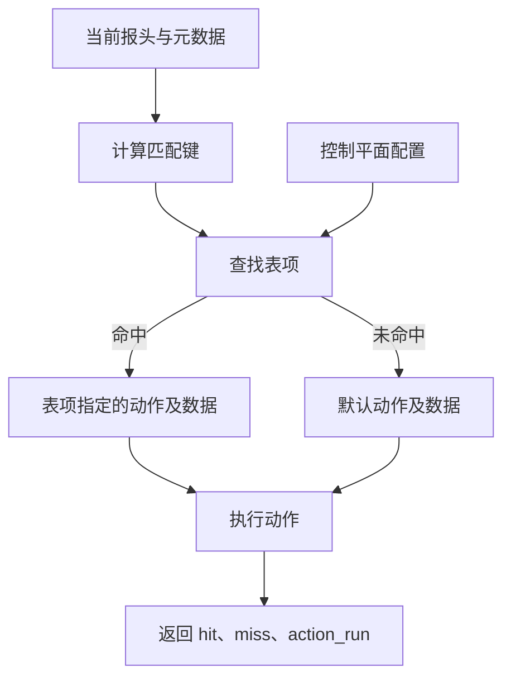

# 08 · 匹配-动作表（Match-Action Table）

本章讨论表的声明、表项、默认动作和查表结果。语言规则依据 P4<sub>16</sub> 规范 v1.2.5。本机验证使用 p4c 1.2.5.10 和 `simple_switch` 1.15.0。涉及目标及控制平面接口的限制时，单独说明。

前面的片段应放在 Control 中，类型及动作需事先声明。片段中的 `hdr.ethernet`、`sm`、`set_egress` 和 `drop` 可采用 8.11 节完整程序的定义。

## 8.1 为什么要有表

转发程序经常需要根据报文中的地址、协议字段或元数据选择处理方式。表将两部分信息分开：P4 程序定义匹配键、匹配种类和可执行动作；表项给出具体匹配条件、动作及动作数据。

表项可以由控制平面配置，也可以在 P4 源码中给出初始值或固定值。因此，“表只声明结构，所有规则都在运行时下发”并不准确。采用动态表项时，许多策略更新只需改表项，无须重新编译 P4 程序。

一条表声明本身就建立了一个表实例，不需要再用构造调用创建它。表声明位于控制块中；控制块的不同实例分别拥有各自的表。

## 8.2 匹配-动作单元的数据流



调用 `apply()` 时先计算键，再查找表项，然后执行选中的动作。动作已经执行完毕，调用者才继续使用查表结果。若动作执行了 `exit`，当前控制调用链立即结束，不会再执行图中的正常返回路径，见 [7.10 节](./07-控制块与动作.md#710-exit-与-return)。

一条表项有多个匹配字段时，各字段条件须同时满足。若有多条表项同时匹配，目标按匹配种类及优先级规则选择一条，并不会依次执行全部匹配动作。

## 8.3 表的基本结构

```p4
table dmac {
    key = {
        hdr.ethernet.dst: exact;
    }
    actions = {
        set_egress;
        drop;
    }
    size = 1024;
    default_action = drop();
}
```

| 属性             | 含义                                                   |
| ---------------- | ------------------------------------------------------ |
| `key`            | 定义如何计算匹配键；可以省略或为空，此时只执行默认动作 |
| `actions`        | 本表允许使用的动作，以及有方向参数的绑定               |
| `default_action` | 未命中时执行的动作；省略时补入 `NoAction`              |
| `size`           | 以表项数表示的期望容量，必须是编译期已知整数           |
| `entries`        | 程序加载时安装的初始表项，可带 `const` 限制修改        |

`size` 不等于当前已有的表项数，也不保证任意一组 1024 条规则都能装入目标。具体容量还受匹配实现及资源限制；某些目标要求显式给出 `size`，另一些可以推导或动态分配。

## 8.4 `key`：匹配什么、怎样匹配

键元素的形式是 `表达式 : match_kind;`。程序结构和表达式的类型在编译时确定，但**表达式的值在每次 `apply()` 时计算**，不是编译期常量。

报头字段、元数据及目标支持的计算表达式都可用于键。例如，`hdr.ethernet.dst: exact;` 匹配当前目的 MAC。读取报头字段前，应先确认相应报头有效，避免把无效报头中的未定义值当作合法键。

### 8.4.1 核心库的三种匹配种类

`core.p4` 定义 `exact`、`ternary` 和 `lpm`，不应在用户程序中重复声明。

| 种类      | 匹配含义                            | 多条规则的选择                          |
| --------- | ----------------------------------- | --------------------------------------- |
| `exact`   | 输入值与表项值相等                  | 相同完整键不能重复安装                  |
| `ternary` | `(输入 & mask) == (value & mask)`   | 使用表项优先级；掩码中 1 更多不代表优先 |
| `lpm`     | 掩码为连续高位 1、低位 0 的前缀匹配 | 在其他匹配条件满足时，选择最长前缀      |

例如，32 位地址的 `32w0x0A000000 &&& 32w0xFF000000` 表示 `10.0.0.0/8`。点分十进制地址不是 P4 源码的整数字面量；后文 CLI 中使用的地址或掩码文本属于控制平面接口语法。

### 8.4.2 V1Model 的扩展

本机 `v1model.p4` 还声明了以下匹配种类：

| 种类       | 用途                                          |
| ---------- | --------------------------------------------- |
| `range`    | 匹配闭区间，例如服务端口范围                  |
| `optional` | 精确匹配一个值，或匹配任意值                  |
| `selector` | 为 `action_selector` 提供选择成员时使用的输入 |

`selector` 不应理解为普通查找字段的第四种匹配算法；它需要相应的动作选择器及 `implementation` 配置。不能仅向普通表的 `key` 增加一个 `selector` 字段，就认为成员选择已经配置完成。

语言和架构允许的组合，也不一定都受目标支持。例如，本机 BMv2 后端会拒绝同一张表中的多个 `lpm` 键。

### 8.4.3 多字段组合

```p4
table port_acl {
    key = {
        sm.ingress_port: exact;
        hdr.ethernet.dst: ternary;
    }
    actions = { set_egress; drop; }
    size = 512;
    default_action = drop();
}
```

一条规则必须同时满足入端口和目的 MAC 条件。这里包含 `ternary`，重叠规则需要优先级；`exact` 字段仍必须给出确定值，不能因为其他字段可通配就把整个键省略。

### 8.4.4 空键表

```p4
table always_run {
    key = { }
    actions = { set_egress; }
    default_action = set_egress(9w2);
}
```

省略 `key` 与空 `key` 具有相同含义：没有可查找的普通表项，每次应用都执行默认动作。正常返回时 `hit` 为 `false`、`miss` 为 `true`；执行了动作并不意味着发生了命中。

## 8.5 `actions`：本表允许的动作

动作须先声明，再写入 `actions`。同一列表中的动作名必须各不相同，不能靠重复列出同一个动作来绑定多组实参；不同表项可以选择同一个动作并提供不同动作数据。

### 8.5.1 参数绑定规则

```p4
action assign_port(out bit<9> output_port, bit<9> port) {
    output_port = port;
}

table bound_port {
    key = { hdr.ethernet.dst: exact; }
    actions = { assign_port(sm.egress_spec); }
    default_action = assign_port(sm.egress_spec, 9w2);
}
```

`output_port` 有方向，在 `actions` 中绑定到 `sm.egress_spec`；无方向的 `port` 是动作数据，由选中的表项或默认动作提供。动作数据既可来自控制平面，也可写在源码的 `entries` 或 `default_action` 中。

绑定有方向参数，是指定调用时使用的表达式或存储位置，不是把运行时值冻结为编译期常量。绑定表达式在对应动作真正执行时求值；`out`、`inout` 的实参必须是可写位置，不能传一个普通常量。

对上面的动作，以下几种动作列表元素需要区分：

| 写法                                | 是否正确                            |
| ----------------------------------- | ----------------------------------- |
| `assign_port(sm.egress_spec);`      | 正确，仅绑定有方向参数              |
| `assign_port;`                      | 错误，缺少 `output_port` 的绑定     |
| `assign_port(sm.egress_spec, 9w2);` | 错误，在 `actions` 中绑定了动作数据 |

表动作实参表达式中不能直接或间接再应用另一张表。动作本身也不能调用表，调用位置的限制见 [第 7 章](./07-控制块与动作.md)。

### 8.5.2 `@tableonly` 和 `@defaultonly`

这两个注解放在**表的 `actions` 列表元素上**，限制动作在该表中的用途：

```p4
table policy {
    key = { hdr.ethernet.dst: exact; }
    actions = {
        @tableonly set_egress;
        @defaultonly drop;
    }
    default_action = drop();
}
```

`set_egress` 可用于普通表项，但不能作为本表默认动作；`drop` 只能作为本表默认动作，不能用于普通表项。未加这两个注解的动作可以用于两者。

不要把它们移到 `action` 声明前，指望获得同样的检查。本机编译器能接受这种错误位置，却不会据此限制该表的默认动作。它们也不是禁止直接调用动作的全局声明。

## 8.6 `default_action`：未命中时执行什么

默认动作必须在本表的 `actions` 列表中，且不能被标为 `@tableonly`。它要补齐动作数据；有方向参数的实参表达式必须与动作列表中的绑定一致。

```p4
table default_port {
    key = { hdr.ethernet.dst: exact; }
    actions = { set_egress; drop; }
    const default_action = set_egress(9w2);
}
```

这里的 `const` 固定了默认动作及其参数，控制平面不能更改。若去掉 `const`，则可在目标接口允许的范围内修改默认动作。源码中为默认动作提供的无方向实参必须在编译期已知。

省略 `default_action` 时，编译器会将默认动作设为 `NoAction`，并把它加入动作列表。`NoAction` 不会自行转发或丢包，只是不改变当前状态，见 [7.7 节](./07-控制块与动作.md#77-noaction-与-mark_to_drop)。

默认动作与通配表项不同：一条能匹配任意输入的普通表项仍会产生 `hit = true`；未命中而执行默认动作则产生 `miss = true`。

## 8.7 源码中的初始表项 `entries`

下面固定两条 Ethernet 分类规则。每个键元组分别对应目的 MAC 和 EtherType：

```p4
table fixed_acl {
    key = {
        hdr.ethernet.dst: ternary;
        hdr.ethernet.etherType: exact;
    }
    actions = { set_egress; drop; }
    default_action = drop();
    const entries = {
        (48w0x020000000002, 16w0x0800): set_egress(9w2);
        (48w0x020000000000 &&& 48w0xFFFFFFFFFF00,
         16w0x0800): set_egress(9w1);
    }
}
```

两条规则重叠时，第一条获选；这里没有显式优先级，编译器按源码顺序安排该三元匹配表的优先关系。目标加载程序时安装这些表项，不是在处理每个报文时重新创建。

各键项必须符合匹配种类和类型要求。比如三元匹配项可以使用 `_` 通配，而本机 BMv2 后端不支持在 `exact` 项上写 `_`。多字段键也不能用一个孤立的 `_` 代替整个元组。完整默认策略应通过 `default_action` 表达。

### 8.7.1 不可变表项与默认动作分别控制

按语言规范：

| 形式                            | 普通表项的修改权限                                  |
| ------------------------------- | --------------------------------------------------- |
| `const entries = { ... }`       | 不能增加、删除或修改普通表项                        |
| `entries = { ... }`             | 可以增加表项；未标为 `const` 的初始条目可修改或删除 |
| `entries` 内的单条 `const` 条目 | 该条目不能修改或删除，其余条目另行判断              |

**默认动作不受 `const entries` 自动锁定**，是否可修改由 `default_action` 自身有没有 `const` 决定。上面的 `fixed_acl` 固定了普通表项，但默认动作没有加 `const`。

### 8.7.2 本机 BMv2 的限制

本机编译器能接受普通 `entries` 和条目级 `const`，但生成的 JSON 被 BMv2 加载后，该表的普通表项整体仍不可修改。实际通过 CLI 增加、修改或删除条目都会得到 `IMMUTABLE_TABLE_ENTRIES`；未加 `const` 的默认动作仍可修改。

这一行为与 [BMv2 加载初始表项的实现](https://github.com/p4lang/behavioral-model/blob/2bdd0b7b2b2ae89faf2720f2158e9842bc6d2dd2/src/bm_sim/P4Objects.cpp#L1958-L2008) 一致，不能仅凭通过编译就认为目标实现了可变初始表项。若实验需要动态维护表项，应不写 `entries`，改为启动后通过控制平面安装，见 8.11 节。

表只能由控制流水线应用，不能用在 Parser 中充当分发表；Parser 的动态分支集合是另一种机制 `value_set`。

## 8.8 表项优先级

全 `exact` 表不需要处理重叠键；单个 `lpm` 字段与其他 `exact` 字段组成的表，由最长前缀决定获选项。包含 `ternary`、`range` 或 `optional` 等字段时，需要为可能重叠的规则定义优先关系。

不能把三元匹配理解成最长前缀匹配。即使一条规则的掩码更加精确，另一条匹配规则也可能凭更高优先级获选。

### 8.8.1 控制平面接口的数值方向

| 场景                                     | 数值规则                                                  |
| ---------------------------------------- | --------------------------------------------------------- |
| P4Runtime 的三元、范围、可选匹配普通表项 | 优先级为正整数，**数值较大者获选**                        |
| BMv2 `simple_switch_CLI` 的对应表项      | 命令末尾提供优先级，**数值较小者获选**                    |
| 只有 `exact`／`lpm` 的表                 | P4Runtime 的 `priority` 置 0；BMv2 CLI 不应附加优先级参数 |

依据分别见 [P4Runtime 1.4.1 的 TableEntry 规则](https://p4lang.github.io/p4runtime/spec/v1.4.1/P4Runtime-Spec.html#sec-table-entry)和 [BMv2 CLI 的 `table_add` 说明](https://github.com/p4lang/behavioral-model/blob/main/docs/runtime_CLI.md#table_add)。它们是不同接口的约定，不能复制数值后假定顺序不变。

P4Runtime 中表示默认动作的 `TableEntry` 不参与普通表项排序，其 `priority` 必须为 0。

多条重叠规则具有相同优先级时，不应依赖插入顺序来获得可移植的结果。需要确定行为时，应为重叠规则配置不同优先级。

### 8.8.2 源码初始表项的优先级属性

规范 v1.2.5 定义 `largest_priority_wins` 和 `priority_delta`，用于确定 `entries` 中初始条目的优先级：前者默认 `true`，表示数值越大优先；后者必须为正整数，默认 1。

| 是否写显式优先级           | 自动计算规则                                                             |
| -------------------------- | ------------------------------------------------------------------------ |
| 所有条目都未写             | 首条优先；大数优先时从末条的 1 向前递增，小数优先时从首条的 1 向后递增   |
| 至少一条写了 `priority=N:` | 首条也必须显式给出；之后省略的值按前一条减去或加上 `priority_delta` 计算 |

例如，首条显式给出 30、步长为 10：在大数优先模式下，后两条自动得到 20、10；在小数优先模式下，则得到 40、50。若三条都省略、使用大数优先和步长 10，则依次为 21、11、1。`priority_delta` 并不是无条件向后递增。

本机还有两点限制：显式 `priority=N:` 放入 `const entries` 会被前端拒绝；放入普通 `entries` 时，前端可据此排序，但 BMv2 JSON 中通常按顺序重编号为 1、2……。后端还会对上述两个表属性报告 `Unknown table property` 警告。因此，不应把源码优先级数字或其中的间隔直接当作 Thrift 接口中的数值。本章的固定表项使用源码顺序，动态优先级通过 CLI 显式设置。

## 8.9 表调用的结果

`table.apply()` 返回的结构体类型由编译器合成，可以概念性地表示为：

```text
apply_result_T {
    bool hit;
    bool miss;
    action_enum_T action_run;
}
```

正常返回时 `miss == !hit`；`action_run` 标识实际执行的动作，包括未命中时执行的默认动作。它不是一个独立的“是否允许转发”标志。

```p4
if (host_exact.apply().miss) {
    ipv4_lpm.apply();
}
```

这段假设两张表已定义。回退之前，`host_exact` 的默认动作已经执行；若它执行了 `exit`，则不会再调用 `ipv4_lpm`。设计默认动作时必须考虑这条执行顺序。

```p4
switch (acl.apply().action_run) {
    drop: { return; }
    set_egress: { /* 继续控制块后续处理 */ }
}
```

`switch` 的动作标签须属于该表。块末尾不会像 C 的 `switch` 那样自动落入下一分支；若 `drop` 动作内部已经 `exit`，上述 `return` 分支也不会执行。`action_run` 只允许在这种 `switch` 选择表达式中使用，不能把它当普通枚举变量随意保存和比较。

每写一次 `apply()` 就是一次实际表应用，不应为了分别读取 `hit` 和 `miss` 而重复查同一张表。动作可能改写报头、更新计数器或产生其他副作用，目标还可能拒绝重复应用同一实例。

## 8.10 表应用的执行顺序

下面是概念性伪代码，不是编译器实现代码：

```text
apply(table):
    key = 按声明顺序计算当前键表达式的值
    entry = 查找并按匹配规则选择一个表项
    if entry 存在:
        hit = true
        selected = entry 的动作及动作数据
    else:
        hit = false
        selected = table 的默认动作及动作数据
    计算选中动作的有方向实参，并绑定动作数据
    执行动作，按参数方向完成复制出
    若执行 exit，则结束当前控制调用链
    返回 { hit, miss = !hit, action_run = 选中的动作 }
```

键在动作执行前已经确定。动作随后修改了键所引用的字段，不会倒过来改变这次查表结果；后续另一张表则会看到修改后的值。

## 8.11 完整示例：可配置的 Ethernet 分类转发

将下面程序保存为 `table-demo.p4`。它按目的 MAC 的掩码条件和 EtherType 共同匹配，动作选择出端口；解析失败或没有匹配规则时丢弃。

这里的 `MyIngress.acl` 只有目的 MAC 和 EtherType 两个键。仓库 [ACL 示例](../examples/04-acl/README.md)中的同名表匹配 IPv4 五元组，动作和参数也不同。控制命令须与实际加载的程序对应，不能仅凭表名相同就复用配置。

```p4
#include <core.p4>
#include <v1model.p4>

header ethernet_t {
    bit<48> dst;
    bit<48> src;
    bit<16> etherType;
}
struct headers { ethernet_t ethernet; }
struct metadata { }

parser MyParser(packet_in packet, out headers hdr,
                inout metadata meta, inout standard_metadata_t sm) {
    state start {
        packet.extract(hdr.ethernet);
        transition accept;
    }
}
control MyVerifyChecksum(inout headers hdr, inout metadata meta) {
    apply { }
}
control MyIngress(inout headers hdr, inout metadata meta,
                  inout standard_metadata_t sm) {
    action drop() {
        mark_to_drop(sm);
        exit;
    }
    action set_egress(bit<9> port) {
        sm.egress_spec = port;
    }
    table acl {
        key = {
            hdr.ethernet.dst: ternary;
            hdr.ethernet.etherType: exact;
        }
        actions = { set_egress; drop; }
        size = 1024;
        default_action = drop();
    }
    apply {
        if (sm.parser_error != error.NoError) {
            drop();
        }
        if (!hdr.ethernet.isValid()) {
            drop();
        }
        acl.apply();
    }
}
control MyEgress(inout headers hdr, inout metadata meta,
                 inout standard_metadata_t sm) {
    apply { }
}
control MyComputeChecksum(inout headers hdr, inout metadata meta) {
    apply { }
}
control MyDeparser(packet_out packet, in headers hdr) {
    apply { packet.emit(hdr.ethernet); }
}

V1Switch(MyParser(), MyVerifyChecksum(), MyIngress(), MyEgress(),
         MyComputeChecksum(), MyDeparser()) main;
```

编译：

```bash
p4test --std p4-16 table-demo.p4
p4c-bm2-ss --std p4-16 --arch v1model -o table-demo.json table-demo.p4
```

按实验拓扑绑定交换机端口 1、2 并加载 JSON 后，将以下内容保存为 `table-entries.txt`：

```text
table_add MyIngress.acl MyIngress.set_egress 0x020000000000&&&0xffffffffff00 0x0800 => 1 20
table_add MyIngress.acl MyIngress.set_egress 0x020000000002&&&0xffffffffffff 0x0800 => 2 10
table_dump MyIngress.acl
```

从保存该文件的目录下发，假设本实验交换机的 Thrift 端口为 9090：

```bash
simple_switch_CLI --thrift-port 9090 < table-entries.txt
```

第一条匹配目的 MAC 前五字节为 `02:00:00:00:00`、EtherType 为 `0x0800` 的帧，选择端口 1；第二条只匹配目的 MAC `02:00:00:00:00:02` 且 EtherType 同为 `0x0800` 的帧，选择端口 2。CLI 命令末尾的 20 和 10 是优先级，不是动作参数。

| 输入                                    | 预期                                   |
| --------------------------------------- | -------------------------------------- |
| `02:00:00:00:00:02`，EtherType `0x0800` | 两条都匹配，优先级 10 获选，输出端口 2 |
| `02:00:00:00:00:03`，EtherType `0x0800` | 仅第一条匹配，输出端口 1               |
| 不匹配上述掩码的 MAC，或其他 EtherType  | 未命中，默认丢弃                       |
| 不足 14 字节的 Ethernet 输入            | 解析失败，丢弃                         |

如在全新的表配置中把第一条优先级改为 5，同一个目的 MAC 为 `02:00:00:00:00:02` 的帧就会选择端口 1。这验证了三元匹配按显式优先级选择，而非按掩码精确程度选择。重复实验应针对本实验交换机清理或重建表项，避免把重复键错误当作新的优先级行为。

本例只解析和重组 Ethernet 报头，`0x0800` 只作为分类条件，不表示程序已经校验 IPv4 内容。程序不修改报头字段，未解析负载由 BMv2 保留，因此成功输出的帧应与输入逐字节一致。ARP、广播泛洪和 IP 路由不在本例实现范围内。

## 8.12 表的约束清单

| 约束                                           | 应如何理解                                       |
| ---------------------------------------------- | ------------------------------------------------ |
| 键结构固定，键值动态                           | 编译时确定表达式及类型，每次应用时读取当前值     |
| 动作列表固定，动作数据可由表项提供             | 控制平面不能安装源码中未列出的动作               |
| 有方向参数在动作列表绑定                       | 绑定表达式或存储位置，不等于冻结运行时值         |
| `const entries` 与 `const default_action` 独立 | 普通表项不可变，不代表默认动作也不可变           |
| `size` 是容量需求                              | 实际可装入规则受目标实现和资源限制               |
| 表项更新使用控制平面接口                       | 普通 P4 语句不能直接增删表项；架构扩展需另行说明 |
| 匹配种类及其组合受目标限制                     | 前端接受不代表后端和运行时全部支持               |

## 8.13 本章小结

应用一张表包含键计算、规则选择和动作执行。判断程序行为时，应同时检查键值来自何处、重叠规则怎样排序、动作参数怎样绑定，以及未命中时会发生什么。源码中的固定表项、默认动作和运行时表项更新具有不同规则，不能仅用“表被锁住”或“优先级越大越先”概括。

## 8.14 下一步

[第 9 章](./09-Deparser反解析器.md)介绍 Deparser 怎样输出有效报头，以及报头顺序、可变长度字段和未解析负载对输出报文的影响。
