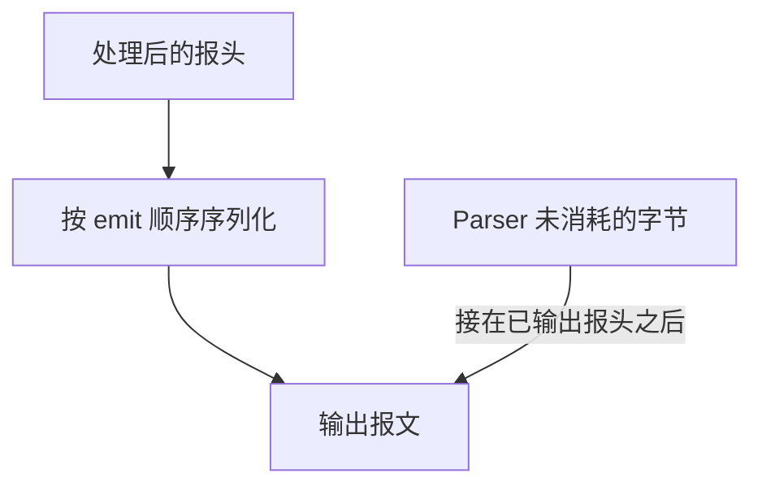

# 09 · Deparser 反解析器

本章介绍 `packet_out.emit` 如何把报头序列化为输出数据，以及它与有效位、未解析负载和校验和的关系。语言规则依据 P4<sub>16</sub> 规范 v1.2.5 第 16 节。本机验证使用 p4c 1.2.5.10 和 `simple_switch` 1.15.0。

前面的代码片段采用 9.6 节中的 Ethernet、VLAN 类型和 V1Model 接口。涉及 IPv4 等其他报头时，另行说明类型和适用范围。

## 9.1 Deparser 的职责

P4<sub>16</sub> 没有专用的 `deparser` 关键字。反解析由带 `packet_out` 参数的控制块完成，具体接口由架构规定。它按照程序指定的顺序输出有效报头，而不是自动把 Parser 的操作倒放一遍。

对于本章的 BMv2 `simple_switch` 普通报文路径，输出由两部分组成：



后半部分是目标保留的未解析负载，不需要把全部应用数据定义为 P4 报头。已经被 Parser 提取或跳过的字节不再属于这一部分；是否重新出现，取决于 Deparser 是否输出保存了这些内容的报头。

## 9.2 一个最小 Deparser

```p4
control MyDeparser(packet_out packet, in headers hdr) {
    apply {
        packet.emit(hdr.ethernet);
        packet.emit(hdr.vlan);
    }
}
```

对常见的 Ethernet → VLAN → IPv4 → TCP 报文，Parser 通常从外层到内层提取，Deparser 也按外层到内层输出，二者顺序通常一致，并非相反。真正决定输出顺序的是执行的 `emit` 顺序，而不是 Parser 的状态声明顺序。

在 V1Model 接口中，`hdr` 的方向为 `in`，Deparser 不能通过它改写字段或有效位。应在之前的 Ingress、Egress 或相应校验和块完成修改。

## 9.3 `packet_out.emit` 的语义

核心库接口可概括为以下声明，已经包含 `core.p4` 时不应重复定义：

```p4
extern packet_out {
    void emit<T>(in T hdr);
}
```

本章使用以下四类对象：

| 对象           | 输出规则                                                     |
| -------------- | ------------------------------------------------------------ |
| `header`       | 有效时按字段声明顺序输出，无效时不输出任何位                 |
| 报头栈         | 按索引从小到大处理每个元素，跳过无效元素                     |
| `header_union` | 输出其中有效的成员；没有有效成员时不输出                     |
| `struct`       | 按字段声明顺序递归输出；各字段须为可输出的报头或报头聚合类型 |

不能直接 `emit` 一个普通 `bit<W>`、枚举或 `error` 值。结构体也不是任意数据的序列化容器：若同时混有普通整数元数据字段，就不能把整个结构体作为报头集合输出。

报头有效位本身不会进入报文；字段之间也不会因声明顺序而自动插入对齐填充。整数按报文位序输出，高位在前。`emit` 不会根据 EtherType 或协议号自动寻找下一层，也不会自动修正长度和校验和。

每次执行 `emit` 都表示一次追加。对同一个有效报头连续调用两次，会输出两份内容；它不是“登记一次待输出报头”的去重操作。本机 BMv2 已验证这一行为。

## 9.4 新增或删除 VLAN 报头

为无 VLAN 的帧增加一层标签时，需要同时初始化新报头、设置有效位并修改外层 EtherType。以下动作要求 `hdr.ethernet` 有效，且 `hdr.vlan` 当前无效：

```p4
action push_vlan() {
    hdr.vlan.setValid();
    hdr.vlan.pcp = 0;
    hdr.vlan.dei = 0;
    hdr.vlan.vid = 100;
    hdr.vlan.etherType = hdr.ethernet.etherType;
    hdr.ethernet.etherType = 0x8100;
}
```

这里先 `setValid()`，再逐一写入字段。向无效报头写字段不会使它自动有效，而且语言不保证这些写入会成为随后有效报头的内容。`setValid()` 自身也不会初始化字段，不能留下未赋值的有效字段再输出。

若只把 Ethernet 的 EtherType 改成 `0x8100`，却没有建立有效的 VLAN 报头，`emit(hdr.vlan)` 会跳过它。输出仍声称下一层是 VLAN，但对应的四字节标签并不存在，接收端会按错误的报文布局解释后续数据。

删除已提取的 VLAN 时，先恢复外层 EtherType，再使标签无效：

```p4
action pop_vlan() {
    hdr.ethernet.etherType = hdr.vlan.etherType;
    hdr.vlan.setInvalid();
}
```

本动作只能在 VLAN 报头有效时调用。仅执行 `setInvalid()` 虽能让标签不再输出，却不会自动修复其他报头的字段。反过来，整份报头赋值已经包含有效位的复制，也不应机械地再调用 `setValid()`；有效性规则见 [5.8 节](./05-类型系统.md#58-header带有效位的报头)。

## 9.5 常见输出对象

### 9.5.1 单个报头

```p4
packet.emit(hdr.ethernet);
```

报头有效时输出所有字段，包括从未修改的字段；P4 不依靠“脏位”决定哪些字段需要写回。

### 9.5.2 报头结构体

9.6 节的 `headers` 按 Ethernet、VLAN 的顺序声明字段，因此可以写成：

```p4
packet.emit(hdr);
```

这与依次输出这两个成员具有相同的序列化顺序。若调整结构体声明顺序，整体 `emit` 的顺序也会改变。对于字段顺序不等于目标报文布局的结构体，应逐个输出所需报头。

结构体自身没有报头有效位；是否输出，由其中各个报头的有效位决定。

### 9.5.3 报头栈

假设 `hdr.mpls` 是已经定义的报头栈：

```p4
packet.emit(hdr.mpls);
```

输出按照索引递增顺序进行，不是按 `setValid()` 的调用先后排列。若索引 0、2 有效而索引 1 无效，就依次输出 0、2，不会为 1 留空位，也不会因为遇到无效元素而停止。

### 9.5.4 报头联合体

假设 `hdr.network` 是包含 IPv4、IPv6 报头的联合体：

```p4
packet.emit(hdr.network);
```

最多输出一个有效成员，不会把全部候选协议依次写入报文。设置另一个成员有效会改变当前有效成员，因此也会改变这次输出；相关规则见 [5.10 节](./05-类型系统.md#510-报头联合体-header_union)。

## 9.6 完整示例：增加或移除最外层 VLAN

下面的 V1Model 程序可以保存为 `deparser-demo.p4`。输入最外层 EtherType 为 `0x8100` 时，它提取并移除一层标签；其他输入增加一层 VID 为 100 的 `0x8100` 标签。处理成功后从原入端口发回。

```p4
#include <core.p4>
#include <v1model.p4>

header ethernet_t {
    bit<48> dst;
    bit<48> src;
    bit<16> etherType;
}
header vlan_t {
    bit<3> pcp;
    bit<1> dei;
    bit<12> vid;
    bit<16> etherType;
}
struct headers {
    ethernet_t ethernet;
    vlan_t vlan;
}
struct metadata { }

parser MyParser(packet_in packet, out headers hdr,
                inout metadata meta, inout standard_metadata_t sm) {
    state start {
        packet.extract(hdr.ethernet);
        transition select(hdr.ethernet.etherType) {
            0x8100: parse_vlan;
            default: accept;
        }
    }
    state parse_vlan {
        packet.extract(hdr.vlan);
        transition accept;
    }
}
control MyVerifyChecksum(inout headers hdr, inout metadata meta) {
    apply { }
}
control MyIngress(inout headers hdr, inout metadata meta,
                  inout standard_metadata_t sm) {
    action push_vlan() {
        hdr.vlan.setValid();
        hdr.vlan.pcp = 0;
        hdr.vlan.dei = 0;
        hdr.vlan.vid = 100;
        hdr.vlan.etherType = hdr.ethernet.etherType;
        hdr.ethernet.etherType = 0x8100;
    }
    action pop_vlan() {
        hdr.ethernet.etherType = hdr.vlan.etherType;
        hdr.vlan.setInvalid();
    }
    apply {
        if (sm.parser_error != error.NoError) {
            mark_to_drop(sm);
            exit;
        }
        if (hdr.vlan.isValid()) {
            pop_vlan();
        } else {
            push_vlan();
        }
        sm.egress_spec = sm.ingress_port;
    }
}
control MyEgress(inout headers hdr, inout metadata meta,
                 inout standard_metadata_t sm) {
    apply { }
}
control MyComputeChecksum(inout headers hdr, inout metadata meta) {
    apply { }
}
control MyDeparser(packet_out packet, in headers hdr) {
    apply {
        packet.emit(hdr.ethernet);
        packet.emit(hdr.vlan);
    }
}

V1Switch(MyParser(), MyVerifyChecksum(), MyIngress(), MyEgress(),
         MyComputeChecksum(), MyDeparser()) main;
```

在保存文件的目录编译：

```bash
p4test --std p4-16 deparser-demo.p4
p4c-bm2-ss --std p4-16 --arch v1model -o deparser-demo.json deparser-demo.p4
```

加载 JSON 并绑定实验端口后，可以构造 Ethernet 帧检查输出：

| 输入                            | 预期输出                                                                    |
| ------------------------------- | --------------------------------------------------------------------------- |
| 无 `0x8100` 外层标签            | 增加四字节标签：PCP 为 0、DEI 为 0、VID 为 100，原 EtherType 放入 VLAN 报头 |
| 最外层为 `0x8100` 标签          | 移除最外层四字节标签，将其内层 EtherType 恢复到 Ethernet 报头               |
| 两层 `0x8100` 标签              | 只移除最外层，内层标签随未解析部分保留                                      |
| Ethernet 或所需 VLAN 报头被截断 | 解析失败，Ingress 丢弃                                                      |

本例只识别最外层的 `0x8100`，不将 `0x88A8` 等其他 TPID 作为待移除标签。它没有解析 IPv4 或 TCP，标签之后的字节由 BMv2 保留；增加或移除 VLAN 不改变这些协议报头本身，因此本例不需要重算 IP 或传输层校验和。

这是验证序列化的实验策略，不是完整的 VLAN 接入控制或交换机转发策略。检查时应比较输入、输出字节及长度，不能只凭“收到回复”判定标签操作正确。

## 9.7 Deparser 中能写哪些逻辑

从语言上看，Deparser 是控制块，实际允许的语句由架构和目标进一步约束。对于本机 V1Model／BMv2，应使用直接、顺序的 `packet.emit(...)` 调用，参见 [BMv2 的 Deparser 限制](https://github.com/p4lang/behavioral-model/blob/2bdd0b7b2b2ae89faf2720f2158e9842bc6d2dd2/docs/simple_switch.md#restrictions-on-code-in-the-deparser-control)。

本机编译验证中，运行时 `if`、表应用以及把 `emit` 包装进动作后调用，均被 BMv2 后端拒绝。即使只是 `if (hdr.vlan.isValid())` 也不能据此绕开目标限制；直接 `emit(hdr.vlan)` 已经会跳过无效报头。

字段修改和条件处理应在合适的前置控制块完成，然后让有效位决定哪些报头输出。

### 9.7.1 校验和的位置由架构规定

V1Model 提供独立的 `VerifyChecksum` 和 `ComputeChecksum`。`update_checksum` 应在 `ComputeChecksum` 中调用，而不是随意放进 Egress 或 Deparser。PSA 没有对应的独立校验和控制块：它提供 `InternetChecksum` 等 extern，规范示例在 Parser 验证、在 Deparser 更新。参见 [PSA 1.2 的 InternetChecksum 示例](https://p4.org/wp-content/uploads/sites/53/p4-spec/docs/PSA-v1.2.html#sec-checksum-examples)。

下面采用 [第 6 章](./06-Parser解析器.md)的 `ipv4_t` 字段名，仅重算有效且 IHL 为 5 的 IPv4 固定报头校验和。它可替换相应程序中的 `MyComputeChecksum`，不是上面 VLAN 实验必需的部分：

```p4
control MyComputeChecksum(inout headers hdr, inout metadata meta) {
    apply {
        update_checksum(
            hdr.ipv4.isValid() && hdr.ipv4.ihl == 5,
            { hdr.ipv4.version, hdr.ipv4.ihl, hdr.ipv4.diffserv,
              hdr.ipv4.totalLen, hdr.ipv4.identification,
              hdr.ipv4.flags, hdr.ipv4.fragOffset,
              hdr.ipv4.ttl, hdr.ipv4.protocol,
              hdr.ipv4.src, hdr.ipv4.dst },
            hdr.ipv4.hdrChecksum,
            HashAlgorithm.csum16);
    }
}
```

待计算字段按 IPv4 报头顺序排列，原 `hdrChecksum` 不加入数据元组。IHL 大于 5 时，校验和还应覆盖选项和 IP 报头内的填充；本片段会跳过这种报头，不能用于给已修改的含选项 IPv4 报头提供正确校验和。

`emit` 不会自动更新校验和。若程序修改 TTL、IP 地址或传输层字段，应按协议和架构补齐所需更新；TCP／UDP 校验和也不能用这里的 IPv4 报头元组代替。

## 9.8 位宽、字节对齐与 `varbit`

P4 语言按位描述报头，并没有要求所有报头的字段总宽度都必须为 8 的倍数。**本机 BMv2 目标要求报头总宽度按字节对齐**：例如，只有一个 `bit<4>` 字段的报头可通过 `p4test`，但会被 `p4c-bm2-ss` 拒绝。

这不要求每个字段都单独占整字节。VLAN 的 PCP、DEI、VID 分别是 3、1、12 位，加上 16 位 EtherType，总共 32 位；字段紧邻排列，没有额外填充。

对于含 `varbit` 的有效报头，输出的是当前实际宽度，不是声明的最大容量。若 `varbit<32>` 字段被提取为 16 位，就只输出这 16 位，再接后续报头。实际宽度为 0 时，该字段不输出任何位，但同一报头的定长字段仍会输出。

`setValid()` 不会替 `varbit` 建立内容或选定实际长度。本章通过合法的变长 `extract` 获得数据及长度；需要复制时，应遵守变长字段及报头赋值的规则。提取长度本身也受目标对齐限制，不能靠 Deparser 自动修补。

## 9.9 哪些数据会出现在输出中

| 数据                                 | BMv2 普通路径中的处理                                  |
| ------------------------------------ | ------------------------------------------------------ |
| 有效且被 `emit` 的报头               | 输出当前字段值，包括未修改字段                         |
| 无效报头                             | 跳过，不保留占位字节                                   |
| 已提取但没有被输出的报头             | 相应输入字节不再自动保留                               |
| Parser 用 `advance` 等操作跳过的数据 | 已被消耗，不会自动重新出现                             |
| Parser 尚未消耗的字节                | 接在 Deparser 输出的报头之后                           |
| 普通元数据                           | 不会自动序列化；需要传送时，应明确编码到输出报头字段中 |

V1Model 的 Deparser 接口没有独立的用户元数据参数，但这不意味着元数据值永远不能进入报文。例如，可以在 Ingress 或 Egress 将选定值写入一个已初始化的有效报头，再由 Deparser 输出。报头格式、协议标识和长度须由程序明确安排。

本章使用 BMv2 文件端口逐字节比较输入输出。该路径不会因 `emit` 自动补齐 Ethernet 最小帧长度或追加 FCS；实际网卡的链路层处理、填充及抓包位置应与软件输出区分。BMv2 也不会仅因为改写 IP 长度字段就自动裁剪尾部字节。

## 9.10 本章小结

检查 Deparser 时，需要同时看输出顺序、有效位、字段初始化和 Parser 游标位置。有效报头只有被输出才会进入报文，已经消耗的输入也不会自动恢复。协议标识、长度与校验和应与最终字节布局保持一致，并按具体架构安排相应修改。

## 9.11 下一步

[第 10 章](./10-架构与包.md)介绍架构怎样定义处理块接口、调度顺序和 extern 能力，以及如何用 Package 将程序装配到目标上。
