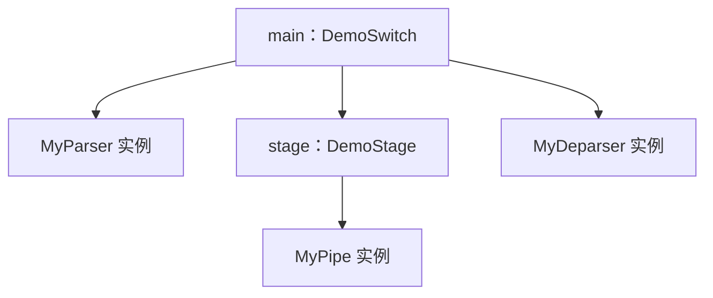

# 10 · 架构与包（Architecture & Package）

本章讨论架构接口、Package 装配，以及实例化与运行时调用的区别。语言规则依据 P4<sub>16</sub> 规范 v1.2.5 第 7.2、15、17 和 18 节，示例使用本机 p4c 1.2.5.10 验证。

## 10.1 为什么需要架构

P4<sub>16</sub> 定义报头、Parser、Control、表和动作等语言机制，但不规定所有目标都必须采用同一条处理流水线。例如，语言没有要求每个设备都具备独立的 Ingress、Egress 或流量管理器。

架构规定哪些处理环节可由 P4 编程、它们如何交换报文和元数据，以及程序可以调用哪些外部功能。目标则负责实现这些接口与行为。理解这一区别，可以避免把 `standard_metadata_t` 或 `V1Switch` 当成 P4 语言内置类型。

| 层次       | 本教程中的例子           | 主要职责                                 |
| ---------- | ------------------------ | ---------------------------------------- |
| 语言       | P4<sub>16</sub>          | 定义类型、语句和求值规则                 |
| 架构       | V1Model                  | 定义可编程块接口、元数据和 extern 的语义 |
| 编译器后端 | p4c 的 BMv2 V1Model 后端 | 将程序映射为目标可加载的形式             |
| 目标实现   | BMv2 `simple_switch`     | 执行报文处理，提供队列、端口等运行环境   |

同一目标可以支持多个架构，同一架构也可以有不同目标实现。具体工具是否支持某个组合，需要查阅其接口和后端说明。

## 10.2 架构描述包含什么

架构通常通过 P4 头文件提供接口，并通过架构规范、文件注释及目标文档补充行为定义。仅凭一个 `.p4` 文件中的类型声明，无法推导全部运行时行为。

| 内容                     | 作用                                             |
| ------------------------ | ------------------------------------------------ |
| 类型、常量和错误值       | 规定端口、时间戳、内置元数据等数据的表示方式     |
| Parser／Control 类型声明 | 规定调用参数的类型、顺序和方向                   |
| Package 类型声明         | 规定装配时所需的子块、子包或其他参数             |
| extern 声明              | 提供计数器、寄存器、哈希、校验和等功能的接口     |
| 配套语义说明             | 规定调用时机、报文路径、丢弃行为和元数据解释方式 |

架构头文件也可以包含常量、辅助函数等定义，不能笼统地说它“只能声明，不能有实现”。不过，extern 的设备功能、端口收发和固定功能模块，并不会因为写出声明就自动得到实现。

例如，V1Model 的程序可以设置 `egress_spec`，但这个字段如何影响入队、复制和输出，要由 V1Model 与 `simple_switch` 的语义解释。

## 10.3 程序如何接入架构

以下片段沿用 [第 9 章完整示例](./09-Deparser反解析器.md#96-完整示例增加或移除最外层-vlan)中的类型和六个处理块：

```p4
V1Switch(MyParser(), MyVerifyChecksum(), MyIngress(), MyEgress(),
         MyComputeChecksum(), MyDeparser()) main;
```

这里的 `MyParser()` 等表达式在编译期构造实例，再把它们交给 `V1Switch`。它们不是“收到一个报文后依次执行六次函数调用”的语句。各块何时运行、哪些路径会跳过或重新进入某些块，由架构及目标调度。

实现不必与接口使用相同的块名或形参名，但参数数量、顺序、方向和类型必须符合接口，类型参数的绑定也必须一致。以位置传参时，顺序按 Package 声明匹配。两个块即使签名相同，也可能承担不同角色；把 Ingress 与 Egress 实例放反，未必能靠类型检查发现。

V1Model 的六个参数都没有默认值或 `@optional` 标记，因此必须全部提供。不需要某个 Control 执行操作时，可以提供接口匹配、`apply` 为空的实现。

## 10.4 一个可检查的自定义架构示例

下面将接口与实现写在同一文件中，便于独立检查。保存为 `architecture-demo.p4`：

```p4
#include <core.p4>

parser DemoParser<H>(packet_in packet, out H hdr);
control DemoPipe<H>(inout H hdr);
control DemoDeparser<H>(packet_out packet, in H hdr);
package DemoStage<H>(DemoPipe<H> pipe);
package DemoSwitch<H>(DemoParser<H> p,
                      DemoStage<H> stage,
                      DemoDeparser<H> deparser);

header byte_t {
    bit<8> value;
}
struct headers {
    byte_t data;
}
parser MyParser(packet_in packet, out headers hdr) {
    state start {
        packet.extract(hdr.data);
        transition accept;
    }
}
control MyPipe(inout headers hdr) {
    apply {
        if (hdr.data.isValid()) {
            hdr.data.value = hdr.data.value + 1;
        }
    }
}
control MyDeparser(packet_out packet, in headers hdr) {
    apply {
        packet.emit(hdr.data);
    }
}

DemoStage<headers>(MyPipe()) stage;
DemoSwitch<headers>(MyParser(), stage, MyDeparser()) main;
```

其中，`DemoParser`、`DemoPipe`、`DemoDeparser` 以分号结束，是接口类型声明；`MyParser`、`MyPipe`、`MyDeparser` 带有主体，是对应的实现。`DemoStage` 包含一个 Control，`DemoSwitch` 再接收这个子包以及 Parser、Deparser 实例。



这张图表示实例的装配关系。Package 声明本身没有写出一条执行流水线；例如“先解析、再修改、最后输出”仍需由架构的运行语义和目标实现规定。

在保存文件的目录执行：

```bash
p4test --std p4-16 architecture-demo.p4
```

本机检查通过，说明这组类型和实例可以合法装配。它还不是能在 `simple_switch` 上运行的程序：本机执行下面的命令会因架构不匹配而失败。

```bash
p4c-bm2-ss --std p4-16 --arch v1model -o architecture-demo.json architecture-demo.p4
```

给包改成 `V1Switch` 的名字也不足以完成适配；还必须满足对应接口和目标语义。需要运行 V1Model 实验时，可使用第 9 章的完整程序。

## 10.5 Package 的类型与约束

Package 用于描述编译期的装配关系。它没有 `apply` 方法，不会在运行时作为普通 Control 被调用，也不能在声明中定义动作、表或处理主体。

Package 的参数都是构造参数，必须无方向，实参必须能在编译期确定。参数并不限于 Parser 和 Control，也可以是符合规则的子包、extern 实例或值。例如，下面是带默认值的独立类型检查示例：

```p4
package Config(bit<8> mode = 1);
Config() main;
```

这里绑定的是 `mode = 1`。它没有为任何现有目标定义报文处理行为，也不是控制平面可以逐包修改的变量。

### 10.5.1 泛型参数与嵌套

10.4 节用 `H` 表示用户报头类型。显式写出的 `<headers>` 要求 Parser、处理块和 Deparser 使用同一个类型。若能从实参推导出来，末尾两行也可以替换为：

```p4
DemoStage(MyPipe()) stage;
DemoSwitch(MyParser(), stage, MyDeparser()) main;
```

类型推导不会消除接口约束。例如，把 `MyPipe` 的 `inout headers` 改成 `in headers`，即使删掉主体中的写操作，装配仍然会因方向不匹配而失败。

这里的类型参数属于接口和 Package 声明，带主体的实现采用具体的 `headers` 类型。泛型按 P4 的类型规则检查，不应套用 C++ 模板可以任意依赖实参成员的直觉。接口中出现 `_` 类型时，表示该位置不要求绑定为某个指定类型；它不是省略 Package 实参的占位符。`_` 的使用范围见规范第 7.2.14 节。

### 10.5.2 默认参数与可选参数

实参能否省略，应查看参数是否有默认值或 `@optional` 标记。下面的示例可单独交给 `p4test`：

```p4
package Stage();
package Top(Stage first, @optional Stage second);

Stage() ingress;
Top(ingress) main;
```

`second` 被省略，其含义由这个架构规定；语言不会自动补出一段空流水线。默认参数则有明确的替代实参。`@optional` 参数不能再声明默认值；参数列表同时包含可选参数和默认参数时，调用须使用命名实参。

## 10.6 `main`：顶层包实例

用于目标部署的完整程序通过顶层命名空间中的 Package 实例 `main` 指定装配结果。`main` 是实例名，不是函数，也不是 P4 保留关键字。它的包类型必须符合所选后端支持的架构。

同一顶层作用域不能重复声明两个 `main`。程序可以包含多个子包和其他实例，但只有选定的 `main` 给出这次编译的顶层装配。多架构项目可以共享类型与处理逻辑，再通过不同入口文件或预处理分支选择相应的接口和 `main`。

### 10.6.1 缺少 `main` 时

头文件、库和未装配片段可以暂时没有 `main`。本机 `p4test` 能检查这类文件；这不代表已经得到可部署程序。

删除 10.4 节最后两行后，本机 `p4test` 返回成功并报告未使用的声明；`p4c-bm2-ss` 则返回失败，并给出缺少 `main` 的诊断。具体诊断文本和严重级别取决于工具。

## 10.7 区分架构要求与目标限制

| 检查项     | 架构规定                     | 目标及编译器还需确认             |
| ---------- | ---------------------------- | -------------------------------- |
| 可编程块   | 接口、参数方向和逻辑处理路径 | 是否支持该架构及相应映射         |
| 元数据     | 字段的含义、可读写位置       | 位宽、保留值及实现限制           |
| extern     | 方法签名、作用和可调用位置   | 支持的类型、容量及操作限制       |
| 匹配与表   | 可用的匹配种类和接口语义     | 键宽、表项数量、组合与优先级限制 |
| 报头与算术 | 各处理块允许执行的操作       | 对齐、运算、阶段与资源限制       |

PSA 本身定义了 `Register`，不能用“PSA 不允许寄存器”来概括架构差异。应分别检查架构是否提供接口，以及具体实现支持哪些用法，参见 [PSA 1.2 的 Registers 定义](https://p4.org/wp-content/uploads/sites/53/p4-spec/docs/PSA-v1.2.html#sec-registers)。

程序在语言层面合法，不保证目标资源足够；两个目标声称支持同一架构，也需要核对功能与资源边界。迁移时，修改 `#include` 或后端选项通常只是适配的一部分。

## 10.8 常见架构

下表列出常见架构及其接口用途。

| 架构    | 常见接口文件                     | 用途与范围                                                  |
| ------- | -------------------------------- | ----------------------------------------------------------- |
| VSS     | `very_simple_switch_model.p4`    | P4<sub>16</sub> 规范第 5 节的教学架构，用于展示完整语言示例 |
| V1Model | `v1model.p4`                     | 本教程中 BMv2 `simple_switch` 使用的架构                    |
| PSA     | `psa.p4`                         | Portable Switch Architecture，规定可移植交换机接口与行为    |
| TNA     | `tna.p4`，由工具链组织相关头文件 | Tofino Native Architecture，面向 Tofino 目标                |
| PNA     | `pna.p4`                         | Portable NIC Architecture，面向可编程网卡的接口             |

接口应使用目标工具链随附的版本，不能仅凭同名文件判断兼容性。[PSA 1.2](https://p4.org/wp-content/uploads/sites/53/p4-spec/docs/PSA-v1.2.html)和 [PNA 0.7](https://p4.org/wp-content/uploads/sites/53/p4-spec/docs/PNA-v0.7.html)均有公开的版本化规范；此处版本号仅用于固定阅读依据。

TNA 也不宜笼统标为“闭源”：p4c 已公开 [`tna.p4`](https://github.com/p4lang/p4c/blob/8b6de3c579e717ee278c38041b868e9ef2345f5f/backends/tofino/bf-p4c/p4include/tna.p4) 等接口文件，Open P4Studio 提供编译与模型相关代码，公开工具链与硬件部署条件见 [16.4.3 节](./16-PSA与TNA简介.md#1643-公开工具链与硬件部署)。

## 10.9 运行时参数与构造参数

Parser 和 Control 的第一组括号声明运行时调用参数，紧随其后的第二组括号才声明构造参数。类型参数使用尖括号 `<...>`，与这两组值参数不同。第一组中的 `packet_in` 等 extern 参数同样无方向，因此不能仅凭是否有 `in`／`out` 判断是不是构造参数。

下面的控制块可作为声明片段加入程序：

```p4
control Add(inout bit<8> value)(bit<8> step = 1) {
    apply {
        value = value + step;
    }
}
control UseAdd(inout bit<8> value) {
    Add(3) plus_three;
    Add() plus_one;
    apply {
        plus_three.apply(value);
        plus_one.apply(value);
    }
}
```

`Add(3)` 在编译期绑定 `step = 3`，`Add()` 使用默认值 1。`plus_three.apply(value)` 只传入第一组参数；执行后，`value` 的结果按 `inout` 规则写回。一次 `UseAdd` 调用使该 8 位值增加 4，溢出时按 8 位无符号运算回绕。

构造参数必须无方向，不能用当前报文的字段或运行时元数据作为构造实参。常量和符合规则的实例可在编译期传入。改变这里的 `step` 要重新装配程序；需要由控制平面动态更新的策略，应使用表项或相应 extern 接口。

块实例在编译期建立；多次 `apply` 是重复执行该实例。实例内部的局部变量与跨报文的 extern 状态也应区分，见 [7.4 节](./07-控制块与动作.md#74-控制块里能放什么)。

## 10.10 直接类型调用

对没有构造参数的 Parser 或 Control，可以用类型名直接调用。本例是可加入程序的 Control 声明片段：

```p4
control Increment(inout bit<8> value) {
    apply {
        value = value + 1;
    }
}
control Twice(inout bit<8> value) {
    apply {
        Increment.apply(value);
        Increment.apply(value);
    }
}
```

每个直接调用位置都隐式建立一个局部实例，再调用其 `apply`。本例没有控制平面可访问的对象，两次调用使 `value` 增加 2。每次处理报文时，不会再动态创建两份新对象。

需要传入构造实参时，应先像 10.9 节那样显式实例化，再调用实例。

规范 v1.2.5 第 15.1 节还给出泛型直接调用示意，但第 13.2、14 节又明确限制 Parser／Control 实现不能泛型，两处表述存在不一致。本机 p4c 能接受部分泛型实现；本章示例采用具体类型的块实现，泛型仅用于接口与 Package 声明。

### 10.10.1 多次调用与控制平面名称

不同作用域内的直接调用建立不同局部实例，完整控制平面名称也不同。同一作用域多次直接调用同一类型时，仍是多个实例，但规范通过 `@name` 赋予它们相同的外部名称。

因此，若该类型包含表等控制平面可访问对象，同一作用域中的重复直接调用会产生重名，规范将这种用法判为非法。本机测试中，普通 BMv2 JSON 生成未拒绝某些重名用例，但生成 P4Info 时报告名称冲突；不能据此把这些程序视为合法用法。

需要两个独立实例时，应分别声明并命名，例如 `first`、`second`；需要复用同一实例时，应重复调用同一个实例名。对在内部实例化寄存器的 Control，这一区别还决定两次调用是否访问同一份寄存器状态。直接调用规则见 [规范第 15.1 节](https://p4.org/wp-content/uploads/sites/53/2024/10/P4-16-spec-v1.2.5.html#sec-direct-invocation)。

直接调用不会改变调用位置的限制：Parser 可以调用子 Parser，Control 可以调用子 Control，二者不能借助这种语法相互调用，也不能递归调用。

## 10.11 本章小结

阅读架构时，先确定块接口与运行语义，再检查 Package 如何绑定实例。类型检查核对接口与参数绑定，目标后端还要检查架构支持及资源限制。构造发生在编译期，`apply` 发生在运行时；实例数量、参数绑定和控制平面名称都应明确。

## 10.12 下一步

[第 11 章](./11-V1Model架构.md)进一步说明 V1Model 的六个块、`standard_metadata_t`、extern 接口和 BMv2 报文路径。
